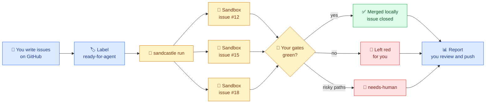
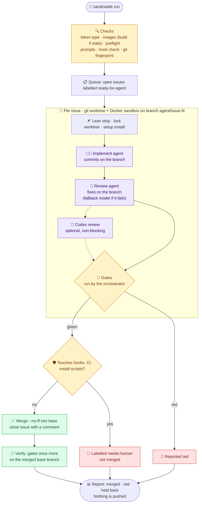

<div align="center">

# 🏰 sandcastle-kit

**Turn your GitHub issues into a software factory.**<br>
Unattended coding agents burn down your issue queue in Docker sandboxes - implemented, reviewed,
gated and merged while you are away from the keyboard.

[](https://github.com/mattpocock/sandcastle)
[](LICENSE)
[](.github/workflows/secret-scan.yml)
[](https://github.com/henkisdabro/sandcastle-kit/releases)

[](https://docs.anthropic.com/en/docs/claude-code)
[](https://github.com/openai/codex)
[](#-requirements)
[](https://nodejs.org)
[](tsconfig.json)
[](https://pnpm.io)

[Why](#-why-sandcastle-kit) · [Requirements](#-requirements) · [Install](#-install-once-per-machine) · [Set up a project](#-set-up-a-project) · [Run](#-run) · [Safety](#-safety-model) · [Troubleshooting](#-troubleshooting)

</div>

> [!NOTE]
> sandcastle-kit is an opinionated issue-burndown kit built on
> **[Sandcastle](https://github.com/mattpocock/sandcastle) by [Matt Pocock](https://github.com/mattpocock)**.
> Sandcastle does the heavy lifting - sandboxing, worktrees and agent orchestration. This kit is
> one way to put it to work, learned from and improved on with gratitude.

Sandcastle runs coding agents in Docker sandboxes. This kit turns it into a ready-made loop for
any GitHub repository: it picks up issues labelled `ready-for-agent`, has one agent implement
each issue and a stronger one review it, runs your project's own lint/build/test gates itself
(an agent never gets to say "tests pass"), merges what is green and closes the issue. One install
serves all your projects; each project adds a small config file.

---

## 💡 Why sandcastle-kit?

You already drive Claude Code or Codex every day - maybe with subagents, maybe several sessions
side by side. That still needs **you** in the loop: approving prompts, watching terminals, copying
context between chats. sandcastle-kit is the next step up.

- 🎫 **GitHub Issues become the universal ticket system.** Write an issue an agent could finish
  with no chat context, add a label, and it joins the queue. No new tool to learn.
- 🏭 **A software factory per repository.** Each queued issue gets its own git worktree and its
  own Docker sandbox, several at once, across several projects.
- 🧪 **Proof, not promises.** The orchestrator - not the agent - runs your gates. Only green
  branches merge, and the merged branch is gated again.
- 🔒 **Safe to leave unattended.** Agents run with permission prompts off, but inside a container
  with a token that cannot push, and risky changes wait for a human.
- ☕ **You come back to a report**: what merged, what is red, what needs you. Nothing is pushed
  until you push it.



---

## 🤖 If you are an AI coding agent reading this

You are probably helping a user who cloned this repository. Read this section first; it is the
whole mental model.

**There are three places. Never mix them up.**

| Place | What lives there | Who edits it |
|---|---|---|
| **The kit** - this repository, cloned once per machine (anywhere) | Orchestrator code, prompts, base Docker image, status view, the Claude Code skill | Nobody, for normal use. It is shared by every project and may be public: **never write credentials, names, client or project details into it.** |
| **User config** - `~/.config/sandcastle-kit/` | `.env` (tokens), optional `config.json` (machine-wide limits), optional `denylist` | The user, once. Never committed anywhere. |
| **Each project** - the repository the agents will work on | `.sandcastle/config.ts`, `.sandcastle/rules.md`, optional `.sandcastle/Dockerfile`; generated `logs/`, `worktrees/`, `.run/` (gitignored) | You and the user, when setting that project up. |

The `sandcastle` command is run **from inside a project**, never from inside the kit (except
`sandcastle doctor`, which works anywhere).

**Map the user's request to an action:**

| The user says | Do this |
|---|---|
| "set this up", "install sandcastle-kit", anything on a fresh clone | Follow [Install](#-install-once-per-machine). Run `sandcastle doctor` and fix each `FIX` line in order until none remain. Ask the user to create the two tokens - you cannot. |
| "use sandcastle in this project", "set up this repo" | Follow [Set up a project](#-set-up-a-project). If the `/sandcastle` skill is installed, `/sandcastle init` does this with the user. |
| "which issues can the agents do?", "triage for sandcastle" | `/sandcastle queue`, or [Queue](#-queue-what-agents-work-on) by hand. |
| "start a run", "burn down the queue" | [Run](#-run). A run takes hours: start it in a separate terminal or pane, not in your own shell. |
| "is it working?", "what is it doing?" | `sandcastle status 0` for a snapshot; logs are in the project's `.sandcastle/logs/`. |
| Anything fails | `sandcastle doctor`, then [Troubleshooting](#-troubleshooting). |

**Rules for you:**

- Run `sandcastle doctor` before anything else. It prints `ok`, `opt` or `FIX` per requirement,
  each `FIX` with the exact command to run.
- Tokens go only in `~/.config/sandcastle-kit/.env` (or a project's gitignored `.sandcastle/.env`).
  Never into the kit, never into a committed file.
- `sandcastle run`, `sandcastle preflight` and `sandcastle lean --measure` call the model and spend
  the user's plan allowance or API credits. Ask before running them.
- A run merges into the project's base branch locally and comments on and closes GitHub issues.
  Confirm with the user before starting one. It never pushes.
- Do not weaken the safety rules below (token type, protected paths, hook checks) to make a run
  start. Fix the cause, or ask the user.

---

## ✨ What it adds to Sandcastle

| | Feature | What you get |
|---|---|---|
| 🚦 | **Gates run by the orchestrator** | Your lint/build/test, run after the agents, in the sandbox. Only green branches merge, and the merged base branch is gated once more. |
| 🧑‍💻 | **Implement, then review** | Claude Sonnet 5.5 implements, Claude Opus 5.5 reviews, on the same warm sandbox; a failed review falls back to the implementer's model. Optional third review by an OpenAI model through Codex (`CROSS_REVIEW=1`). |
| 🪶 | **Lean sandboxes** | The project's skills, subagents, commands, MCP servers and plugins are hidden from sandbox agents unless you keep them, because each one costs context on every turn. |
| 🪝 | **Hooks enforced** | The project's Claude Code hooks are kept, and checked to be runnable in the image before any sandbox starts. |
| 🐳 | **One base image, a layer per project** | Rebuilt only when a Dockerfile changes. |
| 🛫 | **Preflight** | One short reply from every model before any sandbox starts, so an exhausted plan or a too-old CLI stops the run up front instead of halfway through. |
| 🔒 | **Host safety** | Fine-grained tokens only, host git hooks off during a run, the shared `.git` fingerprinted, risky branches held for a human merge (see [Safety model](#-safety-model)). |
| ⚖️ | **Machine-wide limits** | Several projects can run at once without starving each other. |
| 📺 | **A live status view** | Opened automatically in a sibling pane if you use the Herdr terminal multiplexer. |
| 🧩 | **A Claude Code skill** | `/sandcastle`, for setup, issue triage and starting runs. |

## 🔄 How it works

A run starts in a project, on its base branch, with a clean tree. It checks everything first,
then fans out one sandbox per issue, up to `CONCURRENCY` at once and within the machine-wide limit.



## ✅ Requirements

| | Requirement | Notes |
|---|---|---|
| 💻 | **macOS or Linux** | Windows is not supported natively. WSL 2 with Docker Engine may work but is untested. |
| 🐳 | **A Docker-compatible container runtime** | The kit calls the `docker` command, so any runtime that provides it works - see the table below. |
| 🟩 | **Node.js 22+** | 24 LTS recommended. |
| 📦 | **pnpm** | Installs the kit's dependencies. |
| 🌿 | **git 2.31+** | Worktrees are the backbone of every run. |
| 🐙 | **GitHub CLI**, signed in | `gh auth login`. |
| 🧠 | **A Claude subscription or Anthropic API key** | For the implement and review agents. |
| 🔑 | **A fine-grained GitHub token** | Issues read/write and metadata read, on chosen repos only. See [Install](#-install-once-per-machine). |

**Container runtime by operating system**

| OS | Recommended | Also works |
|---|---|---|
| 🍎 **macOS** | **[OrbStack](https://orbstack.dev)** - light, fast, and provides `docker` out of the box | **[Podman](https://podman.io)** with Docker compatibility turned on (Podman Desktop -> Settings -> Docker Compatibility, so `docker` talks to the Podman machine), or Docker Desktop |
| 🐧 **Linux** | **[Docker Engine](https://docs.docker.com/engine/install/)** | **Podman** with the `podman-docker` package, which installs a `docker` command |
| 🪟 **Windows** | Not supported | Try WSL 2 with Docker Engine inside it, at your own risk |

> [!TIP]
> Whichever runtime you choose, `docker info` must succeed in the same shell you run `sandcastle`
> from. `sandcastle doctor` checks this for you.

**Optional:** [Codex CLI](https://github.com/openai/codex) (cross-review),
Herdr (automatic status pane), [gitleaks](https://github.com/gitleaks/gitleaks)
(only to contribute to the kit).

## 📦 Install (once per machine)

```bash
git clone https://github.com/henkisdabro/sandcastle-kit.git
cd sandcastle-kit && pnpm install

# The command, on your PATH (~/.local/bin must be on PATH)
ln -sf "$PWD/bin/sandcastle" ~/.local/bin/sandcastle

# The Claude Code skill (optional, recommended)
ln -sfn "$PWD/skill" ~/.claude/skills/sandcastle

# Credentials, outside the repo
mkdir -p ~/.config/sandcastle-kit
cp .env.example ~/.config/sandcastle-kit/.env && chmod 600 ~/.config/sandcastle-kit/.env

sandcastle doctor
```

Fill in `~/.config/sandcastle-kit/.env`:

- `CLAUDE_CODE_OAUTH_TOKEN` - run `claude setup-token` (uses your Claude subscription), **or**
  `ANTHROPIC_API_KEY` (billed per token).
- `GH_TOKEN` - a **fine-grained** token (`github_pat_...`) from
  <https://github.com/settings/personal-access-tokens/new>: repository access limited to the
  repos you will run, permissions **Issues: Read and write** and **Metadata: Read**.

> [!IMPORTANT]
> Classic (`ghp_`) and OAuth (`gho_`, e.g. `gh auth token`) tokens are refused, because sandbox
> agents run with permission prompts off and such a token could push or edit workflows.

Run `sandcastle doctor` until it reports no `FIX` lines.

## 🧱 Set up a project

From the project's root, on its base branch:

```bash
sandcastle init      # writes .sandcastle/config.ts, rules.md, .gitignore; prints the lean check
```

Then edit, in this order:

1. **`.sandcastle/config.ts`** - `gates` (the commands CI runs: lint, typecheck, build, test),
   `setup` (dependency install in the sandbox), `mounts` (e.g. the host package store), `lean`.
   See [Configuration](#-configuration).
2. **`.sandcastle/rules.md`** - what an agent in *this* repo must read first, must never do
   (deploys, production databases), and how a visual or data change is proven. It is added to
   both prompts.
3. **`.sandcastle/Dockerfile`** - only if the gates need something the base image lacks (browsers,
   Python tooling, a pinned package manager). Start from `templates/Dockerfile` in the kit.
4. **Lean and hooks** - `sandcastle lean` lists what the repo would load into each sandbox and
   checks every kept hook. Keep nothing unless a run needs it; drop only host-only hooks.

```bash
sandcastle build             # base image, then the project layer
sandcastle lean              # lean table + hook check (no model calls)
sandcastle preflight         # one reply per model (spends a little allowance)
```

Commit `config.ts`, `rules.md`, the Dockerfile and `.sandcastle/.gitignore` in the project.

## 📋 Queue: what agents work on

The queue is every open issue with the label from `config.ts` (default `ready-for-agent`). Label
an issue only when an agent with no chat context could finish it from the issue and its comments,
and your gates could prove it. The `/sandcastle queue` skill action walks every open issue,
gathers the facts, asks you the open decisions in batches, writes each decision on its issue, then
labels it.


## 🚀 Run

```bash
sandcastle run                        # every queued issue
ISSUES=12,15 sandcastle run           # just these
DRY_RUN=1 sandcastle run              # implement, review, gate - never merge or close
CONCURRENCY=2 sandcastle run          # parallel sandboxes for this run
CROSS_REVIEW=1 sandcastle run         # add the Codex review
```

A run refuses to start on a dirty tree, off the base branch, while another run of the same
project is live, or while any check fails. Inside Herdr it opens `sandcastle status` in a sibling
pane; elsewhere run `sandcastle status` in a second terminal. Afterwards, push the base branch
yourself when you are happy with it.

> [!TIP]
> Start with `DRY_RUN=1` on a couple of issues to see the whole loop - implement, review, gates -
> without anything being merged or closed.

## 🧰 Commands

| Command | What it does | Calls the model? |
|---|---|---|
| `sandcastle doctor` | Checks machine and project setup; prints the fix for each problem | ➖ no |
| `sandcastle init` | Scaffolds `.sandcastle/` in the current project, then the lean check | ➖ no |
| `sandcastle build [--force]` | Builds `sandcastle-base:<hash>` and `sandcastle-<name>:<hash>`; prunes superseded tags | ➖ no |
| `sandcastle lean [--measure]` | Lists skills/agents/commands/MCP/plugins (hidden or kept) and hooks (kept or dropped); checks kept hooks in the image. `--measure` runs one real turn with and without the extras | 💸 only with `--measure` |
| `sandcastle preflight` | One "Reply OK" from every model, in the project image | 💸 yes, briefly |
| `sandcastle run` | The burndown (above) | 💸 yes |
| `sandcastle status [secs] [collapse]` | Live view; `0` prints once | ➖ no |

## 🔧 Configuration

`.sandcastle/config.ts` in each project exports a plain object:

| Field | Default | Meaning |
|---|---|---|
| `name` | required | Names the project image (`sandcastle-<name>`) and the status view |
| `gates` | required | `[{ name, command }]`, run in order, stopping at the first red |
| `baseBranch` | `"main"` | Branch agents start from and green work merges into |
| `label` | `"ready-for-agent"` | The queue label |
| `concurrency` | `4` | Parallel sandboxes for this project (inside the machine-wide limit) |
| `dockerfile` | none | Project layer on the base image; starts `ARG BASE=sandcastle-base:latest` / `FROM ${BASE}` |
| `mounts` | `[]` | Extra bind mounts `{ hostPath, sandboxPath, readonly? }` |
| `setup` | `[]` | Commands run in each sandbox before the agents (dependency install) |
| `rules` | none | Markdown file added to both prompts under "Project rules" |
| `lean.keep` | `[]` | Items sandboxes keep: `skill:<name>`, `agent:<name>`, `command:<name>`, `mcp:<server>`, `codex-skill:<name>`, `codex-config` |
| `lean.dropHooks` | `[]` | Substrings of hook commands to drop - host-only conveniences only |
| `protectedPaths` | `[]` | Extra paths a branch may not change and still merge automatically |
| `implement` / `review` | 8 / 3 iterations, 2400 s idle | `{ maxIterations, idleTimeoutSeconds }` per agent |

Examples: [`examples/`](examples/).

<details>
<summary><b>Environment variables</b></summary>

| Variable | Default | |
|---|---|---|
| `IMPL_MODEL`, `IMPL_EFFORT` | `claude-sonnet-5-5`, `high` | The implementer |
| `REVIEW_MODEL`, `REVIEW_EFFORT` | `claude-opus-5-5`, `high` | The reviewer |
| `CROSS_REVIEW=1`, `CROSS_REVIEW_MODEL`, `CROSS_REVIEW_EFFORT` | off, `gpt-6-astra`, `high` | Codex review, signed in with a read-only copy of `~/.codex/auth.json` |
| `ISSUES`, `CONCURRENCY`, `DRY_RUN` | queue label, config, off | Per run |
| `SKIP_PREFLIGHT=1` | off | Skip the model check |
| `SANDCASTLE_MAX_SANDBOXES`, `SANDCASTLE_MAX_GATES` | 6, 2 | Machine-wide limits (also `~/.config/sandcastle-kit/config.json`: `{"maxSandboxes": 6, "maxGates": 2}`) |

Effort levels are `low`, `medium`, `high`, `xhigh`, `max`. Anthropic suggests `medium` as a
starting point for agentic coding on both 5.5 models; the kit defaults to `high` for quality.
Measure before changing it.

</details>

## 🪶 Lean sandboxes and hooks

A sandbox has no user-level `~/.claude`, so the project's own Claude Code config is everything an
agent loads - and each skill description and MCP tool schema is paid on every turn. Before the
agent starts, each worktree loses `.claude/skills`, `.claude/agents`, `.claude/commands`,
`.agents/skills` (read by Codex), `.mcp.json`, `.codex/config.toml`, and the plugin, marketplace,
MCP-enable and status-line keys of `.claude/settings.json`. Permissions and `env` stay. The
changes are marked skip-worktree, so an agent can never commit them. `lean.keep` brings items
back. On a real project this saved ~2,500 input tokens per agent turn.

**Hooks are the opposite: kept.** They cost no context and are how a repo enforces its rules -
guards, linters, test gates, audit logs. `lean.dropHooks` removes host-only conveniences (a token
compressor, a preview server, a notification), never a guard. Before any sandbox starts, every
kept hook is checked in the image: executable on PATH, scripts present, Python compiles, top-level
imports resolve. A failing hook stops the run; fix it in the project's Dockerfile. Hooks in the
untracked `.claude/settings.local.json` never reach a sandbox, and the check warns about them. Git
hooks run on agent commits inside the sandbox as usual. The Codex review does not run Claude Code
hooks.

## 🔒 Safety model

Agents run unattended with permission prompts off, inside Docker. The container is the boundary,
and the kit narrows what can cross it:

- 🔑 **Tokens.** Only a fine-grained GitHub token (issues and metadata on chosen repos) enters the
  sandbox. It cannot push, edit workflows or change settings. Empty values are refused so a host
  `ANTHROPIC_API_KEY` cannot leak in.
- 🪝 **Host git hooks off.** Sandcastle mounts the project's `.git` into every container. During a
  run the host's own git calls ignore hooks, so a branch that adds `.husky/post-merge` does not
  run it on your machine when it lands.
- 🧬 **`.git` fingerprint.** `.git/config`, `.git/info/` and the base branch are fingerprinted; if a
  sandbox changes them, the run stops before the host runs another git command there.
- 🛡️ **Protected paths.** A green branch that changes hooks, CI, `.claude/` settings, `.sandcastle/`,
  package-manager config or install scripts is labelled `needs-human` and left for you to merge.
- 🚫 **Nothing is pushed or deployed** by the kit. Prompts forbid deploys and production commands;
  put the project's own prohibitions in `rules.md`.
- 📁 **Sandbox transcripts** stay in the project's `.sandcastle/logs/`, not in `~/.claude/projects`.

> [!WARNING]
> Do not weaken these rules to make a run start. If a check fails, fix the cause.

## 🚦 Concurrency

Several projects can run at once; one project runs once at a time (`run.lock`). A machine-wide
pool caps live sandboxes (default 6) and gate runs (default 2) across all projects. Agents mostly
wait on the model, so the sandbox cap mainly limits memory and plan usage; gates are the
CPU-heavy part, and running too many at once produces false test failures. The status header
shows the pool (`machine: sandboxes 3/6 · gates 1/2`). All runs share one plan allowance; the
first issue that hits the usage limit stops that run's queue.

## 🩺 Troubleshooting

| Symptom | Cause and fix |
|---|---|
| `Docker running` shows `FIX` | Start OrbStack, Podman machine (`podman machine start`), Docker Desktop or the Docker daemon, and check `docker info` works in that shell. |
| `GH_TOKEN is not a fine-grained token` | Create a `github_pat_` token as in [Install](#-install-once-per-machine). A project's `.sandcastle/.env` overrides the shared one - check both. |
| `Preflight failed` naming a model | Plan limit reached, token expired, or the image's Claude Code is older than the model needs: bump `CLAUDE_CODE_VERSION` in `docker/base.Dockerfile`; the next run rebuilds. |
| `A kept hook cannot run in the image` | Install what the hook calls in the project's Dockerfile, or - only for host-only conveniences - add it to `lean.dropHooks`. |
| `placeholders Sandcastle cannot fill` | `rules.md` contains `{{SOMETHING}}`; reword it. |
| `Another sandcastle run of this project is live` | One run per project. Wait; if that process is gone, the lock clears itself on the next run. |
| `STOPPED ... .git/config ... changed` | Inspect `git config --local --list`, `.git/info/` and `git reflog <base>` before any other git command in that repo. |
| An issue `CRASHED` with "trust dialog" or exit code 1 | Read the last lines of `.sandcastle/logs/agent-issue-<n>-*.log`; usually a usage limit. |
| Status view shows nothing | Run it from inside the project; `sandcastle status 0` prints once. |

## 🤝 Contributing to the kit

`AGENTS.md` has the layout and conventions. This repository is public and used daily by its
maintainer, so nothing personal, client-specific or secret may be committed: enable the guard with
`git config core.hooksPath .githooks` (requires `gitleaks`; add your own denylist at
`~/.config/sandcastle-kit/denylist`). CI scans every push for secrets.

## 🙏 Credits and licence

Built on **[Sandcastle](https://github.com/mattpocock/sandcastle)** by
**[Matt Pocock](https://github.com/mattpocock)**, which does all the sandboxing, worktree and agent
orchestration underneath; this kit is one opinionated way to use it. Sandcastle's own templates
are the place to start if you want to build your own workflow. If this kit helps you, go and star
the original.

MIT - see [`LICENSE`](LICENSE). Sandcastle's licence is reproduced in [`NOTICE`](NOTICE).
