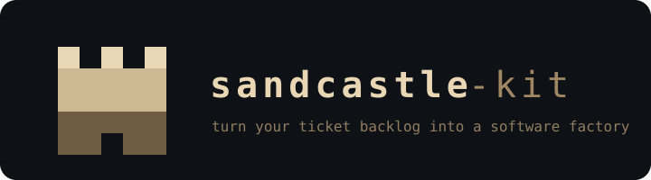
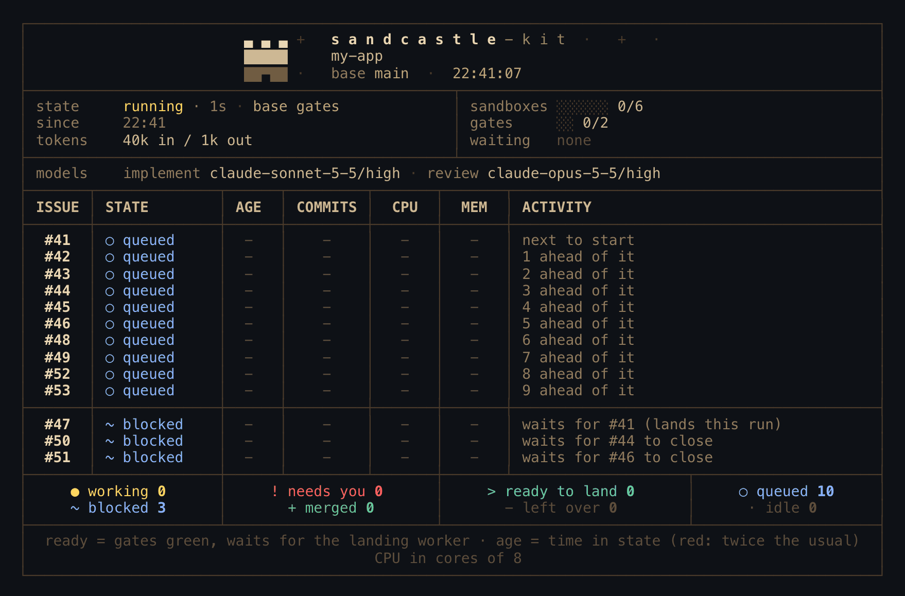
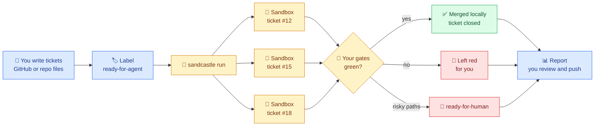
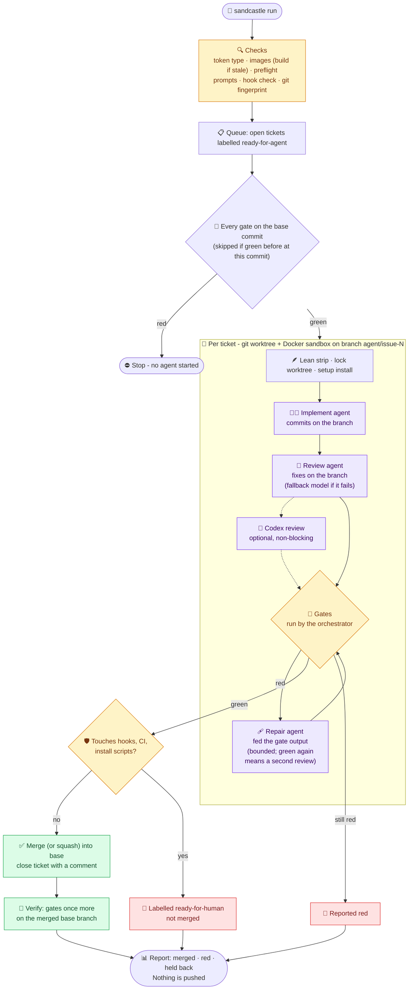
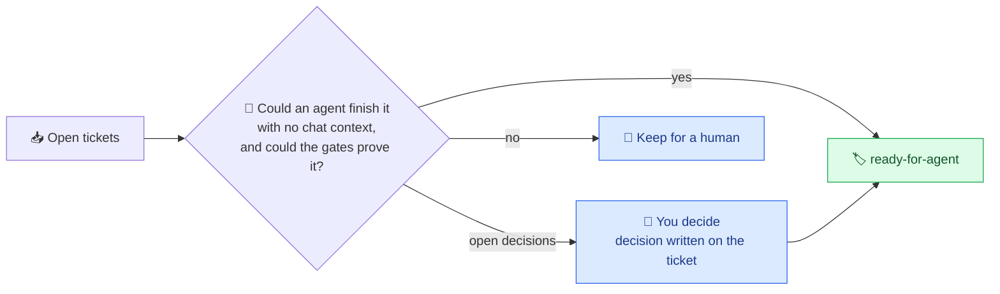
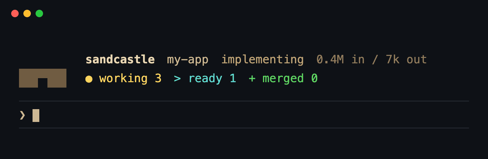

<div align="center">

<a href="https://henkisdabro.github.io/sandcastle-kit/"></a>



Unattended coding agents burn down your queue of GitHub issues or ticket files in Docker sandboxes - implemented, reviewed,
gated and merged while you are away from the keyboard.

[](https://github.com/mattpocock/sandcastle)
[](LICENSE)
[](.github/workflows/secret-scan.yml)
[](https://github.com/henkisdabro/sandcastle-kit/releases)

[](https://docs.anthropic.com/en/docs/claude-code)
[](https://github.com/openai/codex)
[](docs/INSTALL.md#-requirements)
[](https://nodejs.org)
[](tsconfig.json)
[](https://pnpm.io)

[Website](https://henkisdabro.github.io/sandcastle-kit/) · [Who it is for](#-who-is-this-for) · [Quick start](#-quick-start) · [Why](#-why-sandcastle-kit) · [Install details](docs/INSTALL.md) · [Set up a project](#-set-up-a-project) · [Mark tickets ready](#-how-to-mark-a-ticket-ready) · [Trackers](#-trackers-github-or-ticket-files) · [Run](#-run) · [After a run](#-after-a-run) · [Herdr](#-works-best-in-herdr) · [Updating](#-updating) · [Safety](#-safety-model) · [Troubleshooting](#-troubleshooting)

</div>

> [!NOTE]
> sandcastle-kit is an opinionated ticket-burndown kit built on
> **[Sandcastle](https://github.com/mattpocock/sandcastle) by [Matt Pocock](https://github.com/mattpocock)**.
> Sandcastle does the heavy lifting - sandboxing, worktrees and agent orchestration. This kit is
> one way to put it to work, learned from and improved on with gratitude.

Sandcastle runs coding agents in Docker sandboxes. This kit turns it into a ready-made loop for
any repository whose tickets are GitHub Issues or Markdown files in the repo: it picks up tickets
marked `ready-for-agent`, has one agent implement each ticket and a stronger one review it, runs
your project's own lint/build/test gates itself (an agent never gets to say "tests pass"), merges
what is green and closes the ticket. One install serves all your projects; each project adds a
small config file.

## 🙋 Who is this for?

**In one line:** developers who already work with Claude Code or Codex, keep their to-do list as
tickets, and want the well-specified ones done while they are away from the keyboard.

**It is a good fit if you:**

- 🧑‍💻 are a solo developer, freelancer or small team with a backlog of clear, small-to-medium
  tickets - bug fixes, small features, refactors, test coverage, dependency and docs chores;
- 🗂️ track work in **GitHub Issues**, or as **Markdown files in the repo** (including the
  `.scratch/` layout from [Matt Pocock's skills](https://github.com/mattpocock/skills), if you use them - you do not have to);
- ✅ have real **gates** - lint, typecheck, tests, a build - that a machine can run. They are how the kit
  knows work is good, so the better your tests, the more you can hand over;
- 🖥️ have a Mac or Linux machine with Docker (or OrbStack, or Podman) and a Claude subscription or API key;
- 🌙 are happy to come back to a report and review what merged, rather than watch it happen.

**It is probably not for you if:**

- your tickets are vague ("make it faster", "improve onboarding") - an unattended agent with no chat
  context needs a closed spec, and the [queue step](#-queue-what-agents-work-on) helps you write one;
- the repo has no automated checks - nothing then stands between an agent's guess and your base branch;
- you want an agent pair-programming with you live (use Claude Code directly), or work that needs a
  production system, a device or a secret the sandbox must not have;
- your tickets live only in Linear, Jira or another tool. Linear issues can be *blockers* today, and
  the [tracker interface](#-trackers-github-or-ticket-files) is built for more, but only GitHub and ticket files are queues so far.

**What a day looks like:** in the morning you write or triage a handful of tickets and mark them
ready. You start a run and go about your day. When you are back there is a report: which tickets
merged into your local base branch (nothing is ever pushed), which are red and why, and which
need you. You review and push what you like, land a branch you fixed or requeue a ticket with a
note, and repeat.

**Do I need anyone else's tools?** No, but one is recommended. The kit needs only Docker, Node, pnpm,
git, jq and, for GitHub tickets, the `gh` CLI. It also supports the workflow from
**[Matt Pocock's skills](https://github.com/mattpocock/skills)** - the same author as Sandcastle,
which this kit is built on - and we recommend installing them: `/grill-with-docs`, `/to-spec`
and `/to-tickets` are a good way to turn an idea into tickets an unattended agent can finish, and
`/triage` keeps incoming tickets in shape. Run his `/setup-matt-pocock-skills` in your repo once
and the kit reads what it wrote (which tracker, which label), with no extra configuration. It stays
optional: skip his skills and one line in `config.ts` does the same job.

### 📖 The words used here

New to GitHub or to agents? These are the only terms you need.

| Word | Plain meaning |
|---|---|
| **Ticket** | One piece of work, written down: a title, a description of what should change, and how you will know it is done. On GitHub a ticket is an **issue**; in the files tracker it is a Markdown file. |
| **GitHub issue** | GitHub's built-in ticket: a page in your repository (the **Issues** tab) with a title, a description and a comment thread. |
| **Label** | A coloured tag you stick on a GitHub issue, such as `bug` or `ready-for-agent`. Labels are how this kit knows which tickets to work on: it only touches the ones carrying its queue label. |
| **`ready-for-agent`** | The kit's default queue label. It means "an agent may do this without asking me anything". Putting it on a ticket is you saying yes. [How to add it](#-how-to-mark-a-ticket-ready). |
| **Queue** | Every ticket currently marked `ready-for-agent`. A run works through it. |
| **Gate** | A command that must pass before anything merges: your linter, type checker, tests, build. You list them once in `config.ts`. |
| **Sandbox** | A throwaway Docker container in which one agent works on one ticket, on its own git branch, so it cannot touch your machine or other tickets. |
| **Base branch** | The branch (usually `main`) that green work is merged into, locally. Nothing is pushed. |
| **`ready-for-human`** | Added by the kit when a change is risky or a ticket cannot be finished unattended. It takes the ticket out of the queue until you look. (Earlier versions called it `needs-human`; a ticket carrying that is still held.) |
| **`needs-triage`** | Put by agents on follow-up tickets they file during a run (GitHub). Never queued by itself: the closing summary lists them for you to triage. |

> [!TIP]
> **AI coding agent?** Start at [the section written for you](#-if-you-are-an-ai-coding-agent-reading-this), then run `sandcastle doctor`.

## ⚡ Quick start

**You need:** macOS or Linux, Node 22+, pnpm, git, jq, the GitHub CLI signed in (`gh auth login`;
skippable if your tickets are files in the repo), and a container runtime - [OrbStack](https://orbstack.dev) or [Podman](https://podman.io) on
macOS, [Docker Engine](https://docs.docker.com/engine/install/) on Linux.
[Full requirements](docs/INSTALL.md#-requirements).

**1. Install the kit** (once per machine) - one line, paste it into your terminal:

```bash
git clone https://github.com/henkisdabro/sandcastle-kit.git ~/sandcastle-kit && cd ~/sandcastle-kit && pnpm install && ./bin/sandcastle setup
```

`setup` puts the `sandcastle` command on your PATH, installs the agent skill, walks you through
your Claude and GitHub tokens, and finishes with a health check. Re-run it any time.
([What it does, and doing it by hand](docs/INSTALL.md).)

**2. Point it at a project:**

```bash
cd ~/code/your-project
sandcastle init              # or ask your agent: /sandcastle init
sandcastle build
```

`init` fills in the gate commands (`lint`, `test`, ...) from your stack; check them against CI in
`.sandcastle/config.ts` - see [Set up a project](#-set-up-a-project).

> [!TIP]
> **Recommended, optional:** install [Matt Pocock's skills](https://github.com/mattpocock/skills) too
> and run `/setup-matt-pocock-skills` in your project. The kit understands the tracker and labels it
> records, and his `/grill-with-docs`, `/to-tickets` and `/triage` are a good way to write the tickets
> this kit works through. Nothing here requires them.

**3. Mark some tickets `ready-for-agent` - on GitHub that is a label you add to an issue ([step by step](#-how-to-mark-a-ticket-ready), no experience needed); in ticket files it is a `Status:` line ([Trackers](#-trackers-github-or-ticket-files)) - and try a dry run:**

```bash
DRY_RUN=1 sandcastle run     # implement, review, gate - never merge or close
```

---

## 💡 Why sandcastle-kit?

You already drive Claude Code or Codex every day - maybe with subagents, maybe several sessions
side by side. That still needs **you** in the loop: approving prompts, watching terminals, copying
context between chats. sandcastle-kit is the next step up.

- 🎫 **Your tickets stay where they are.** GitHub Issues or Markdown files in the repo: write a
  ticket an agent could finish with no chat context, mark it ready, and it joins the queue. No new
  tool to learn.
- 🏭 **A software factory per repository.** Each queued ticket gets its own git worktree and its
  own Docker sandbox, several at once, across several projects.
- 🧪 **Proof, not promises.** The orchestrator - not the agent - runs your gates. Only green
  branches merge, and the merged branch is gated again.
- 🔒 **Safe to leave unattended.** Agents run with permission prompts off, but inside a container
  with a token that cannot push, and risky changes wait for a human.
- ☕ **You come back to a report**: what merged, what is red, what needs you. Nothing is pushed
  until you push it.



## ✨ What it adds to Sandcastle

| | Feature | What you get |
|---|---|---|
| 🚦 | **Gates run by the orchestrator** | Your lint/build/test, run after the agents, in the sandbox. Only green branches merge, and the merged base branch is gated once more. |
| 🧱 | **A green base first** | Every gate runs on the base commit in the image before any agent starts. A gate red there would be red on every branch, so the run stops before it spends anything. |
| 🩹 | **Repair on red** | A red gate gets one repair pass on the same warm sandbox, fed the gate's own output, then the gates run again - and up to two more while each pass turns up a failure the last one did not see. A branch a repair turned green gets the review pass again, on the repair commits, before it can land. |
| 🗂️ | **Your tracker** | Tickets are GitHub Issues (the default) or Markdown files in the repo - in the layout [Matt Pocock's setup skill](#-trackers-github-or-ticket-files) uses, so a repo that ran it works with no extra config. |
| 🔗 | **Ticket dependencies** | `Blocked by #12` in a ticket body holds it back until #12 is closed. It can also wait on a Linear issue (`ENG-42`) or an in-repo task file - see [Blockers](#-blockers-github-linear-ticket-files). |
| 🧑‍💻 | **Implement, then review** | Claude Sonnet 5.5 implements, Claude Opus 5.5 reviews, on the same warm sandbox; a failed review falls back to the implementer's model. A `model:` or `effort:` label gives one ticket a different implementer. Optional third review by an OpenAI model through Codex (`CROSS_REVIEW=1`). |
| 🪶 | **Lean sandboxes** | The project's skills, subagents, commands and MCP servers are hidden from sandbox agents unless you keep them, and its plugins always, because each one costs context on every turn. |
| 🪝 | **Hooks enforced** | The project's Claude Code hooks are kept, and checked to be runnable in the image before any sandbox starts. |
| 🐳 | **One base image, a layer per project** | Rebuilt only when a Dockerfile or the Claude Code or Codex version changes - see [The image's agent versions](#-the-images-agent-versions). |
| 🛫 | **Preflight** | One short reply from every model before any sandbox starts, so an exhausted plan or a too-old CLI stops the run up front instead of halfway through. |
| ♻️ | **Picks up where it stopped** | A ticket re-run on its old branch builds on it instead of starting again, and a branch that was already green costs only the gates - see [Re-runs](#-re-runs). A killed run's leftover sandboxes are stopped by the next run or `sandcastle clean`. |
| 🛬 | **Landing you control** | Each ticket lands as soon as its gates are green, while the others still run, as a merge commit or squashed (`land`); a conflict or a red merge is sent back once for a second try in the same run, and a ticket whose last blocker lands starts at once. Between runs, `sandcastle preview` shows which unlanded branches would conflict, `sandcastle land <n>` merges and gates one by hand, and `sandcastle requeue <n>` sends one back with a note. `autonomy` lets one run take further turns by itself, up to `drain`. |
| 🔒 | **Host safety** | Fine-grained tokens only, host git hooks off during a run, the shared `.git` fingerprinted, risky branches held for a human merge (see [Safety model](#-safety-model)). |
| ⚖️ | **Machine-wide limits** | Several projects can run at once without starving each other. |
| 📺 | **A live status view** | `sandcastle status` in any terminal: every ticket of the run and where it is - working, ready to land, needing you, queued, blocked, merged - which gate is running, and when landing should start. |
| 🖥️ | **Best in [Herdr](https://herdr.dev)** | The run opens its own tab with the status view, and rolls the run up in Herdr's sidebar (a pane per sandbox is opt-in) - see [Works best in Herdr](#-works-best-in-herdr). |
| 🔭 | **A Claude Code mod** | Optional: the session that started the run shows it above the prompt, says when a ticket needs you, and is told when the run ends - see [The Claude Code mod](#-the-claude-code-mod). |
| 🧩 | **An agent skill** | `/sandcastle` in Claude Code, `$sandcastle` in Codex, also read by OpenCode - for setup, auditing a repo for work, ticket triage, starting and closing runs, and updating. |

## 🔄 How it works

A run starts in a project, on its base branch, with a clean tree. It checks everything first,
then fans out one sandbox per ticket, up to `CONCURRENCY` at once and within the machine-wide limit.



A green gate run proves only that the configured gate commands passed on that branch - no more than those commands check. Whether the change does what the ticket asked is checked by the review agent, not the gates, which is why every branch is reviewed before it is gated and a repaired branch is reviewed again. A live run rarely reaches the repair path, because agents run the gates themselves before they finish. `SANDCASTLE_TEST_RED_GATE=1` (see the [Configuration](#-configuration) table) counts each ticket's first gate run as red to exercise it, at the cost of one repair pass per ticket.

The gates also run in the Linux sandbox, so a green run proves Linux only. A branch can still be red on macOS or Windows (BSD tools, bash 3.2, shell shims and terminal flags differ), and landing does not check that: it gates in the same Linux sandbox. A project that ships to macOS or Windows can add a CI job on that OS, or run its gates on the host before pushing.

## 🧱 Set up a project

From the project's root, on its base branch:

```bash
sandcastle init      # writes .sandcastle/config.ts, rules.md, .gitignore; prints the lean check
```

`init` reads the stack from the repo root - `package.json` (with its lockfile and scripts),
`pyproject.toml` + `uv.lock`, `go.mod` or `Cargo.toml` - and fills in the gates and setup from it.
Where the base image lacks the toolchain (uv, Go, Rust, Bun) it also writes
`.sandcastle/Dockerfile`. Treat what it writes as a starting point. Anything else, poetry and pipenv
included, gets a placeholder gate that fails until you copy in what CI runs.

Then edit, in this order:

0. **Where do your tickets live?** Nothing to do for GitHub Issues. For Markdown tickets set
   `tracker: "files"` in `config.ts` (or let the kit read `docs/agents/issue-tracker.md` if you
   ran [Matt Pocock's setup skill](https://github.com/mattpocock/skills), recommended but optional). `sandcastle queue` shows which tracker the kit chose and why;
   see [Trackers](#-trackers-github-or-ticket-files).
1. **`.sandcastle/config.ts`** - `gates` (the commands CI runs: lint, typecheck, build, test),
   `setup` (dependency install in the sandbox), `mounts` (e.g. a host cache; `pnpmStore: true` mounts the host's pnpm store), `lean`.
   See [Configuration](#-configuration). Gates run in the Linux sandbox, so green proves Linux only:
   if the project ships to macOS or Windows, add a CI job on that OS or run the gates on the host
   before pushing (see [How it works](#-how-it-works)).
2. **`.sandcastle/rules.md`** - what an agent in *this* repo must read first, must never do
   (deploys, production databases), and how a visual or data change is proven. It is added to
   the implement, review and repair prompts, and reaches only those agents: the landing merge is
   the kit's own `git merge`, so rules do not reach it (see
   [a branch conflicts at landing](#-troubleshooting)).
   `init` leaves three questions there for you to answer - which committed files a command
   writes (also `generated` in `config.ts`), which paths an agent must never touch, and which gate
   catches drift in generated files (see [A gate for generated files](#-a-gate-for-generated-files)) -
   and the `/sandcastle` skill's init action asks them for you.
3. **`.sandcastle/Dockerfile`** - only if the gates need something the base image lacks (browsers,
   Python tooling, a pinned package manager). Start from `templates/Dockerfile` in the kit.
4. **Lean and hooks** - `sandcastle lean` lists what the repo would load into each sandbox and
   checks every kept hook. Keep nothing unless a run needs it; drop only host-only hooks.

```bash
sandcastle build             # base image, then the project layer
sandcastle lean              # lean table + hook check (no model calls)
sandcastle gates             # every gate on the base commit in the image (no model calls)
sandcastle preflight         # one reply per model (spends a little allowance)
```

Commit `config.ts`, `rules.md`, the Dockerfile and `.sandcastle/.gitignore` in the project.

### 🧪 A gate for generated files

When the repo commits files that a build generates (minified CSS, a data file built from JSON, a
sitemap), a gate should prove they match the sources. Otherwise a branch can land sources and
generated output that disagree. A reviewer that finds a change no gate exercises says so, and the
closing summary lists the ticket under Needs you as `merged - check by hand`, with what to check.

### 🧩 A criterion left undone

Every acceptance criterion a ticket lists is in scope, and so is a regression the branch causes. An
agent that knowingly leaves a criterion undone says so in an `<unmet>` line of its final message. The
branch still lands if its gates are green, but the ticket stays open with a comment naming the
criterion (its merge says `part of` the ticket, not `closes` it, so the next run does not take it for
finished), and the closing summary lists it under Needs you as `merged, partly done`. The next run
picks up the remainder. A held branch's criterion is on its Needs you line, and `sandcastle land <n>`
lands such a branch the same way: `part of` the ticket, left open with the criterion commented.

Gates run under `sh -c` in the sandbox (dash on Debian), so write the recipe in POSIX sh. This one
names the build's outputs in `OUT`, runs the build, records which of those paths changed, restores
only those paths and fails, listing them, if any differed:

```ts
gates: [
  {
    name: "generated-in-sync",
    command:
      "OUT='dist/site.css data/index.json dist/sitemap.xml'; pnpm run build || exit 1; diff=$(git status --porcelain -- $OUT ':!dist/sitemap.xml'); git checkout -- $(git ls-files -- $OUT); git clean -fdq -- $OUT; if [ -n \"$diff\" ]; then echo \"$diff\"; echo 'Generated files differ from the commit: run the build and commit them.' >&2; exit 1; fi",
  },
],
```

- Never restore with `git checkout -- .`. The gate runs in the agent's branch worktree, and that
  would discard any other uncommitted file there. `git checkout` also stops without restoring
  anything if a path it is given is not tracked yet, so the recipe hands it only
  `git ls-files -- $OUT`; `git clean` removes new, untracked output.
- The `:!path` exclusion is for output that changes on every build (a sitemap `lastmod`). Making
  the build deterministic, for example by dating `lastmod` from the last commit, is better than
  excluding it.
- `OUT` is split on spaces, so paths with spaces need listing differently.

Declare the same files under `generated` in `.sandcastle/config.ts`, with the command that writes
them: `generated: [{ paths: ["dist/"], regen: "pnpm build" }]`. A merge that conflicts only in
those paths is then resolved by taking either side, re-running `setup` and running `regen`, with no
agent - both when a re-run merges the base into a branch from an earlier run, and at landing. A
landing resolved this way happens in a throwaway sandbox (the host never runs project code), as a
merge with the usual `Merge agent/issue-N (closes #N)` message. Before the base moves, the host checks
that the commit merges exactly the base tip and the gated head and changes nothing beyond a plain
merge outside `generated` paths; otherwise nothing lands and the ticket is left as a conflict. With
`land: "squash"` the checked merge's tree then lands as one commit, as any other squash does. The drift gate still proves the result matches
the sources when the merged base is gated again at the end of the run.

## 📋 Queue: what agents work on

The queue is every open ticket marked `ready-for-agent` (a GitHub label, or a ticket file's `Status:`;
the value is `label` in `config.ts`). Mark a ticket only when an agent with no chat context could finish it from the ticket and its comments,
and your gates could prove it. The `/sandcastle queue` skill action walks every open ticket,
gathers the facts, asks you the open decisions in batches, writes each decision on its ticket, then
labels it. No tickets yet? `/sandcastle audit` reviews the repo with read-only agents and files what they find, ready to queue.

A ticket that has to wait for another says so in its body: `Blocked by #12` or `Depends on #12`.
A run holds it while #12 is open. When #12 is in the same run, the ticket starts in that run, as
soon as #12 has landed and closed (a chain of tickets drains in one run); a blocker outside the run
holds it for a later one. A blocker can also live outside
GitHub; see [Blockers](#-blockers-github-linear-ticket-files). `sandcastle queue` lists the queue
and what holds each ticket back.

A hard ticket can ask for a stronger implementer: a GitHub label `model:<id>`
(`model:claude-opus-5-5`) and/or `effort:<level>` sets the implement and repair passes for that
ticket only, over `IMPL_*` and `config.ts`. The run lists the override next to the ticket, refuses a
malformed label before anything starts, and preflight asks that model for a reply too. Reviews keep
the project's pair. Ticket files have no labels, so this is GitHub-only.

### 🏷️ How to mark a ticket ready

**On GitHub** (the default):

1. **Create the label once per repository.** In the repo, open **Issues > Labels > New label**
   and name it exactly `ready-for-agent` (or run
   `gh label create ready-for-agent --description "Ready for an unattended agent" --color 0E8A16`).
   If your team already uses another name, set `label` in `config.ts` instead. Until the label
   exists, `sandcastle doctor` in the project prints a `FIX` line with the command that creates it.
2. **Put it on an issue.** Open the issue, click the gear next to **Labels** in the right-hand
   sidebar and tick `ready-for-agent`. From a terminal: `gh issue edit 12 --add-label ready-for-agent`.
3. **Take it off to pull the ticket back.** The kit removes the label itself when it finishes.

**In ticket files:** add a line `Status: ready-for-agent` directly under the ticket's title and
commit it. See [Trackers](#-trackers-github-or-ticket-files).

**Before you do, check the ticket is ready.** An agent has only the ticket and the code, never your
chat. A good one says what should change, where to look, and how you will know it worked ("the
signup form rejects an empty email; `pnpm test` covers it"). If you are unsure, the
`/sandcastle queue` skill action reads your open tickets with you and only labels the ones that
qualify.

Where the queue lives is your choice - see [Trackers](#-trackers-github-or-ticket-files). Blockers
can also be Linear issues or ticket files.



### 🧷 Blockers: GitHub, Linear, ticket files

Only the ticket **body** is read: a `Blocked by ...` line in a comment does nothing, and a run
starts the ticket anyway. Both `sandcastle run` and `sandcastle blockers` warn about that, and about
comments whose blockers are all closed (stale). `sandcastle queue` and `sandcastle run` also warn,
and `sandcastle blockers` lists, the queued tickets a blocker would hold for good - one that does
not exist, tickets that wait for each other, a Linear blocker that cannot be read - and a
`Blocked by ENG-42` whose key `blockers.linear` does not name, which is ignored.

| Named in the body | Waits until | Enable |
|---|---|---|
| `Blocked by #12`, `Depends on #12` | issue or pull request #12 is closed or merged | always on |
| `Blocked by ENG-42` | the Linear issue is in a *completed* or *canceled* state | `blockers.linear: ["ENG"]` and `LINEAR_API_KEY` |
| `Blocked by .scratch/checkout/issues/03-pay.md` | that file on the base branch has `Status: done` | the files tracker, or `blockers.files: { dir }` |
| `Blocked by: 01, 02` (a header line in a ticket file) | those tickets of the same feature are done | the files tracker |

Several may share a line: `Blocked by #12, ENG-42 and .scratch/checkout/issues/03-pay.md`.

Write the line as plain text. One inside a code block or inline code (backticks) is an example, not a blocker, so a ticket can quote blocker lines without waiting on them.

```ts
// .sandcastle/config.ts
blockers: {
  linear: ["ENG", "OPS"],                             // Linear team keys
  files: { dir: ".scratch", done: ["done", "shipped"] }, // where ticket files live; done defaults to done, closed, resolved, wontfix
},
```

- **Linear** needs a personal API key (read-only is enough) as `LINEAR_API_KEY` in
  `~/.config/sandcastle-kit/.env`, not the project's `.sandcastle/.env` (Sandcastle forwards that
  file into every container, so the kit refuses the key there). It stays on the host. `sandcastle doctor` checks it when `blockers.linear` is set.
- **Ticket files** are read from the base branch, not your working tree, so a blocker counts as done
  once its `Status:` change is committed there. Front matter (`status: done`) is read too.
- **Unreadable = open.** A missing Linear key, a network error or a missing file holds the ticket
  back; guessing wrong would start work on a missing foundation.

## 🗂️ Trackers: GitHub or ticket files

A tracker is where tickets live. The kit ships two:

| Tracker | Tickets are | Queue | Done |
|---|---|---|---|
| `github` (default) | GitHub Issues, through `gh` | open issues with the `label` | closed, label removed |
| `files` | Markdown files `.scratch/<feature>/issues/<NN>-<slug>.md` | files whose `Status:` equals the queue value | `Status: done`, committed on the base branch |

**Which one a project uses**, first match wins:

1. `tracker` in `.sandcastle/config.ts`: `"github"`, `"files"`, or `{ type: "files", dir: "tickets", done: [...] }`.
2. **Matt Pocock's setup, if the repo has it.** [`/setup-matt-pocock-skills`](https://github.com/mattpocock/skills)
   writes `docs/agents/issue-tracker.md` (`# Issue tracker: GitHub` or `Local Markdown`) and
   `docs/agents/triage-labels.md`. The kit reads both: the tracker from the first, and from the
   second the labels it uses for Matt's triage roles - the queue (`ready-for-agent`), the hold
   (`ready-for-human`), agents' follow-ups (`needs-triage`) and, for ticket files, `wontfix` as a
   done status. A repo that renamed a label needs no setting; without the file the kit uses Matt's names. GitLab and "other" trackers are noticed and reported by `sandcastle doctor`; the kit falls
   back to GitHub.
3. GitHub.

**Matt Pocock's skills are supported and recommended, never required.** Install
[his skills](https://github.com/mattpocock/skills) and run `/setup-matt-pocock-skills` in the
project: that writes `docs/agents/`, the kit detects it, and tickets that `/to-tickets` writes
(`.scratch/...`) or tickets that `/triage` labels `ready-for-agent` are picked up as they are - the
skills plan and shape the work, the kit burns it down unattended. Without them, `tracker: "files"`
and a `.scratch/` folder (or plain GitHub Issues) is the whole setup.

**The files layout** (Matt's "Local Markdown"):

```markdown
# Add the cart

Status: ready-for-agent
Blocked by: 01

What to build...

## Comments

### 2026-09-30 - sandcastle
Merged by the Sandcastle loop from `agent/issue-checkout-02`...
```

Keep `Status:` and `Blocked by:` as plain lines directly under the title, together: only that
block is read, so a "Status:" in the description below is just text. A value may be in backticks;
`Blocked by:` takes bare numbers (`01, 02`) for tickets of the same feature.

A ticket is named by its feature and number: `checkout-02` in branches (`agent/issue-checkout-02`),
logs and the status view. `sandcastle queue` lists the queue and what holds each ticket back;
`sandcastle doctor` says which tracker was chosen and why.

**Who writes to the tracker.** With GitHub, agents comment and label themselves, as before. With
`files`, agents write nothing to the tickets: they end with `<report>...</report>` (or
`<blocked>...</blocked>` to hand the ticket to a human), and the orchestrator posts it, commits it to
the base branch and marks the ticket `done` or `ready-for-human`. That keeps ticket files out of the
agents' branches, and the GitHub token out of the sandbox when nothing needs it (a `files` project
does not require `GH_TOKEN`).

**Limits.** The `files` tracker needs the run to start from a clean base branch (it commits ticket
changes there). Linear as a full tracker is not built; Linear issues work as blockers today.


## 🚀 Run

```bash
sandcastle run                        # every queued ticket
TICKETS=12,15 sandcastle run           # just these
sandcastle run 12 15                  # the same, as arguments
DRY_RUN=1 sandcastle run              # implement, review, gate - never merge or close
sandcastle run --dry                  # the same, as an argument
CONCURRENCY=2 sandcastle run          # parallel sandboxes for this run
sandcastle run --concurrency 2        # the same, as an argument
sandcastle run --detach               # start it as a process of its own and return (see Detached runs)
CROSS_REVIEW=1 sandcastle run         # add the Codex review
AUTONOMY_LEVEL=1 sandcastle run       # offer to re-run conflicted and unblocked tickets (see autonomy)
AUTONOMY_LEVEL=drain sandcastle run   # keep taking turns until the queue is drained or a stop condition holds
```

**After labelling, wait a few seconds.** On GitHub, `gh issue list --label` can miss a ticket labelled
moments earlier (the search index lags), so a run started straight after `--add-label` or a
`sandcastle requeue` can leave that ticket out without saying so. Give GitHub a few seconds before
`sandcastle run`.

**Before anything is spent.** A run refuses to start on a dirty tree, off the base branch, while
another run of the same project is live, or while any check fails. It prints the tickets it will
start (with any `model:` override), the models, the Claude Code and Codex versions, the machine-wide
pool and `Keep awake: on`, and - once the project has run before - a rough estimate of tokens and
time, as a range from the median to the 80th percentile of the tickets in the last three runs that the same implement model built (a ticket's `model:` label, else the default; a model with no history there is estimated from all of them and the line says the estimate is low). A carried branch (one ahead of the base, which a base merge may conflict with) is priced from earlier carried tickets - those that had a conflict resolved or ran as carried - and a fresh ticket from the rest; the line gives the split `(N carried, M fresh)`, and says the estimate is low for a carried ticket with no carried history. When a `Blocked by` chain in the run takes longer than the tickets over the slots, the chain sets the time, as the sum of its own tickets' times: `(N tickets in sequence)`. The machine-wide gates pool is counted too: every ticket's gate passes (from earlier runs' pre-landing gate lines, without the wait for a slot) share the `maxGates` slots, and when that takes longer than the rest it sets the time: `(gate runs on N slot(s) set the time)`. Tickets that others wait for start first; a ticket
whose blocker is in the run starts when that blocker has landed, one whose blocker is open and not
in the run waits for a later run, and so does one whose existing branch changes a file another ready
ticket's branch also changes. Then come the image check, preflight, the hook check and the base
gates; a red one stops the run before any agent starts.

When another run is live and holds or wants sandbox slots, the start also says how the machine is
split, before the estimate: `webshop is live (6 slots, demand 5): this run's share is 3; it starts
as webshop's tickets finish, the first likely in ~12m`. The wait comes from that project's usual
time for an issue and the ages of its working tickets, so it is left out where that project has no
history. A run from an older kit is named as one that ignores shares (`webshop's run predates
shares: it keeps taking free slots until it ends`); the run still starts. Nothing is asked: the
split applies by itself ([Concurrency](#-concurrency)), and the estimate divides by the run's share, not the
machine limit. In a detached run the line is in `.sandcastle/logs/run-output.log`.

**While it runs.** The status view opens first, before the slow checks, and its run cell names the
stage the run is in. Inside Herdr the run lays it out itself (below), and does not start if it
cannot; elsewhere run `sandcastle status` in a second terminal. The run prints a heartbeat line
every five minutes while agents work, and the status view flags a sandbox whose log has been quiet
for ten. Each agent pass writes a readable log and its raw stream - every tool call and result - in
`.sandcastle/logs/` (see [What a run leaves behind](#-what-a-run-leaves-behind)). With
`USAGE_CHECK=1` the run also reads the plan's usage after preflight and before each ticket, with
the host's Claude Code login, read-only, when the sandboxes spend a subscription token (with an
API key it says it does not apply; the details are under [Configuration](#-configuration)).

The status view reads each ticket of a live run from the run's own record, so it always agrees
with the run. Under the run band, one full-width **settings** row shows the run's settings:
`settings  autonomy 0 1 2 [3] drain · turn 2/3` - the autonomy level lit and bracketed, the
others greyed, and the turn out of the level's cap (level 1 asks after every turn, so it has no
cap: `turn 2`). Below 100 columns only the active level stays (`autonomy 3 · turn 2/3`). Then the
repair attempts a ticket gets after a red gate (`repair 1`; with `repair.attempts: 0` it is a
greyed `○ repair`, which drops below 80 columns) and the run's concurrency after the machine-wide
sandbox cap (`concurrency 4`, or `concurrency 6 (asked 8)` when the cap clamped what
`--concurrency`, `CONCURRENCY` or the config asked for).
Cross-review is on the row too: `● cross-review gpt-6-astra high` when it runs, and a greyed
`○ cross-review` when it is off (dropped below 80 columns); the models cell then holds only models. A live
run's row comes from its record; between runs `sandcastle status` shows what the next run would use,
prefixed `next run:` (so it is not read as the ended run's recorded settings), and a bare `status.sh` falls back to the last run's record, marked
`(last run)`. The row shows only what the record holds: a record from an older kit has no settings,
and draws no row.

The row also shows the usage guard: `● usage-guard 90%` with `USAGE_CHECK=1` (its stop
threshold, `USAGE_STOP`), or `○ usage-guard` greyed when it is off, which drops below 80 columns.
When the guard cannot get a reading (a 403 turns it off for the run, a rate limit, an expired
Claude Code login or no token at all leaves it without one for now) the row says so in the warning colour:
`● usage-guard 90% (no reading - not guarding)`. A row too wide for the pane wraps onto further
lines rather than cut anything off.

| State | Means |
|---|---|
| `setup` `impl` `resolve` `review` `codex` `gates` `repair` | Working. `resolve` is a re-run's conflicted base merge being resolved, with its own log (`agent-issue-<id>-resolve-<id>.log`) and its own line in `timings.jsonl`. `gates` names the gate running (`2/7 pytest`) or says it waits for a machine-wide gates slot; its output is in `.sandcastle/logs/agent-issue-<id>-gates-<id>.log`. AGE turns red at twice the step's usual time in this project, and the note starts `3x over, usually 5m` (in red) at three times it |
| `ready` | Implemented, reviewed, gates green: waits for the landing worker, which lands each ticket as it goes green. `human merge: .github/` means it will be held for a person instead |
| `landing` | Being merged; the run line counts landing down (`landing 6/25`) |
| `gate red` `conflict` `held` `uncommitted` `crashed` `not landed` | Needs you. A conflict names the files and the branch merged before it that changed them; `held` with no commits is a ticket handed back to a person (a held branch you then merged by hand reads `merged`, "closes on push"); `uncommitted`: the agent's work is in its kept worktree, not committed |
| `stopped` `orphaned` `stalled` | Needs you. `stopped`: finished, but the run stopped before landing (it says why, and lands on the next run). `orphaned`: its run was killed and its container still works - `sandcastle clean` or the next run stops it. `stalled`: no container, and its log quiet for 30 minutes |
| `withdrawn` | Closed, taken out of the queue or marked `ready-for-human` during the run - someone's decision. Not landed, and not started if it came before its sandbox |
| `queued` `blocked` | Not started: next to start, how many ahead, that it waits for the run's share of the machine's sandbox slots, or what it waits for and whether this run holds that blocker. A `requeued` line marks a second attempt this run, after a conflict or a red at landing |
| `merged` `no change` `skipped` | Done, found nothing to do, or not started because the run stopped early |
| `left over` | A branch from an earlier run, not in this one; `sandcastle clean` removes it once it is merged |

**Landing.** Each green branch lands as soon as its gates pass, while the others still run, on one
landing worker: landing moves the base branch, which the run guards against sandboxes changing, and
the kit's own writes are the only moves it accepts. So a dependant of a ticket in this run starts once that ticket has landed and closed. Branches from earlier
runs land first. Each lands as a merge commit, or as one squashed commit with `land: "squash"`; a
branch that changes hooks, CI or install scripts is held for you instead (see
[Safety model](#-safety-model)). The ticket is closed with a comment saying the work is merged
locally and not yet pushed, and the merged base branch is gated once more. A dry run lands nothing
and ends by checking that its tickets and the tracker are unchanged.

> [!TIP]
> Start with `DRY_RUN=1` on a couple of tickets to see the whole loop - implement, review, gates -
> without anything being merged or closed.

### 🛰️ Detached runs

An agent that starts a run should not hold it: a harness's background command has a time cap
(Claude Code: 2 hours) and ends with the session, and a run killed mid-landing leaves work half
merged. `sandcastle run --detach` (or `SANDCASTLE_DETACH=1`) starts the same run as a process of its
own, in its own session, and returns:

```bash
sandcastle run --detach               # checks what a run checks, starts it, returns
sandcastle wait                       # blocks until it ends, then prints the closing summary
sandcastle wait 6600                  # ... or gives up after 6600 s (exit 124), leaving the run alone
sandcastle stop                       # SIGINT, as Ctrl-C in its terminal would
```

- **`--detach`** checks what a run checks before it starts - a clean tree on the base branch, no
  other run live, the autonomy level - and refuses with the same message if one fails. The run's
  output goes to `.sandcastle/logs/run-output.log` (emptied at each start), and the command waits
  up to a minute for the run's status view, then prints `Run started detached (pid <pid>). Status
  view: pane <id> (tab <id>). Output: ...`. Outside Herdr the status view is `sandcastle status`
  in a terminal of yours. A run that ends before it is going is reported with the end of its
  output. A detached run ignores SIGHUP.
- **Not with autonomy level 1**, which asks whether to run again at the end of each turn and has
  no terminal to ask in: `Autonomy level 1 asks a question ... Use level 2 or 3, or run attached.`
  Levels 2, 3 and `drain` work as usual.
- **`sandcastle wait [seconds]`** blocks while the run holds the project's run lock, then prints
  what `sandcastle report` prints and exits with the run's own exit code (recorded in
  `run.json` as `exitCode`). With a timeout it exits 124 and leaves the run alone, so a harness's
  time cap is met by starting it again. With no run live it prints the last summary at once and
  exits with the recorded code (0 when there is none).
- **`sandcastle stop`** sends the live run a SIGINT - the same as Ctrl-C attached: it stops its
  sandboxes and records how it ended - and prints `Stopping the run (pid <pid>)`. With no run
  live: `No run is live.`
- While a detached run is live, the **status view** closes with the last three lines of
  `run-output.log` under a light rule, so the run's own messages are on screen without a pane of
  their own.

A run in a terminal of your own (`sandcastle run`) works as before.

### 📊 After a run

Every run ends with a closing summary, in the order you act on it: **Done**; **Needs you** (held
branches, merged tickets the reviewer says no gate proves, merged tickets left open with a criterion
undone, `needs-triage` issues opened during the run, counted in the header as "to triage"); **Needs
fixing** (red, conflicted, crashed or unlanded branches, with the files or tests and causes several
branches share); **Runnable now / Still blocked** (blockers re-read after landing); **Local state**
(commits not on the upstream - the tickets are closed but the code has not left your machine); and
the **Next step**. `sandcastle report` prints it again at any time, with git and the blockers as they
are now. Then:

- **Push** the base branch yourself when you are happy with it. The kit never pushes.
- **A red or conflicted branch** you have fixed on the branch itself: `sandcastle land <n>` merges it
  the way a run does, gates the merge in a sandbox and closes the ticket (or, with a criterion
  recorded unmet, leaves it open with that criterion commented) - never a hand-written
  `git merge`. Or leave it queued: its next run resumes the branch (see [Re-runs](#-re-runs)).
- **A ticket that needs a new attempt:** `sandcastle requeue <n> --note "..."` puts it back in the
  queue with your note as a comment, takes the hold label (`ready-for-human`) off, and makes the next run re-implement it
  rather than land the old branch.
- **Several unlanded branches:** `sandcastle preview` dry-merges them onto the base in landing order
  and names the ones that would conflict, before anything is merged.
- **Leftovers:** `sandcastle clean` removes leftover worktrees, finished branches, exited sandbox containers and the kit's dangling images. Docker's build cache is not the kit's to prune: `sandcastle doctor` shows its size, and `docker builder prune` frees it.

`autonomy` (or `AUTONOMY_LEVEL` for one run) lets one `sandcastle run` take further turns by itself:
after a turn it re-runs only the tickets that ended in a merge conflict or whose blockers have now
landed - `1` asks first, `2` re-runs once, `3` up to twice. Each turn prints its own closing summary.
A dry run, a stopped run, a run that hit a usage limit and a merged base that is red never re-run.

`autonomy: "drain"` (or `AUTONOMY_LEVEL=drain`) keeps taking turns until no ticket is left to run
again, for a queue that needs more turns than `3` gives - a ticket that conflicts across turns, and
the tickets waiting on it. A `Blocked by` chain whose links are all queued needs no extra turn: each
ticket starts in the same run once its last blocker lands. A red ticket is not run again. After every turn it checks four stops and prints the one that holds as a line
naming the cause: **no progress** (the turn landed nothing and released nothing), **the same ticket
conflicting in two turns running** (named, read from `.sandcastle/logs/outcomes.json`), **a red
merged base**, and **a usage limit or a stopped run**. A hard cap of 20 turns is the backstop. After
the last turn it prints `Drain: <N> turns, <landed> landed, stopped because <cause>`.

A drain takes only what its own turns lead to: every turn after the first takes exactly the previous
turn's re-runnable tickets, never the whole queue. So a ticket queued after the run started waits for
the next `sandcastle run`, and the closing lines name each one
(`#151 was queued after this run started: \`sandcastle run\` takes it`).

### 🔁 Re-runs

A queued ticket with a branch from an earlier run builds on that branch:

- The base is merged into the branch first. A conflict goes to the implementer; a conflict only in
  [`generated`](#-a-gate-for-generated-files) paths is resolved by regenerating them, with no agent.
- A branch that was reviewed and green, and has gained nothing since but merge commits, skips
  implement and review: a clean base merge goes straight to the gates, a conflicted one gets a short
  resolver prompt first, and a merge an earlier run left on it that no review has read (a held
  resolution, say) gets a review of the merge alone. A re-run whose only change since its last
  review is the base merge gets a review of the merge alone too. The record behind both is `.sandcastle/logs/heads.json`, which also keeps a criterion its
  agents left undone, so a branch that skips them still lands as partly done, and their
  [`changelog`](#-configuration) lines, so its closing summary still lists them; `sandcastle requeue`
  clears a ticket's entry.
- When the short resolver prompt resolves a conflicted base merge, the kit checks the result
  against git's own automatic merge: a resolution may change only the files git could not
  merge itself (and [`generated`](#-a-gate-for-generated-files) paths). If it also edits a file git
  merged cleanly - typically adapting another ticket's landed code to this one - the ticket is held
  for a person, with those files named in the note, because such an edit can silently drop another
  ticket's lines while every gate stays green. Two tickets that both rework one hot file often end
  here. The hold is deliberate; see [Troubleshooting](#-troubleshooting) for what to check.
- A file git cannot merge (a lockfile, a [`generated`](#-a-gate-for-generated-files) path, a minified
  blob) conflicts at landing whatever the order, so one ticket at a time has it in flight. Each
  ticket's files are its branch's changed files plus its `Touches:` line; a ticket that shares such a
  file with one in flight shows as blocked, "waits for #N: both change <file> (git cannot merge it)",
  and starts when that ticket lands or leaves the run. Tickets that share only mergeable files start
  together, the start naming them, and landing (with one requeue) resolves the overlap.
- A ticket closed, unqueued or sent to a human mid-run is left alone, and a run that died between
  merging and closing is finished by the next one.

### 🗃️ What a run leaves behind

Everything lives under the project's `.sandcastle/`, gitignored by `sandcastle init`:

| Path | What |
|---|---|
| `logs/run.json` | The live run's record: stage, versions, each ticket's state. The status view and `sandcastle report` read it |
| `logs/history.jsonl` | One line per finished run, since `run.json` is replaced by the next |
| `logs/timings.jsonl` | Every step - image, preflight, base gates, each agent pass and gate run - with its time, model, tokens and each gate's own time and a `carried` flag on a ticket whose branch was carried into the run (`ok` is false for a gate run with a red gate, named in `red`). A gate run's wait for a machine-wide gates slot is `waitMs`, not part of its `ms`. The estimate and the status view's "usual time" come from it |
| `logs/agent-issue-<id>-<phase>-<id>.log` and `.jsonl` | Each agent pass's readable log (a failed tool result shows as one `! error: ...` or `! exit N: ...` line; its closing `Tokens processed (all turns)` is every turn's input and cache tokens added up, not a context size), and its raw stream beside it; `-gates-` is the orchestrator's gate output. Moved to `logs/archive/` by the next run or `sandcastle clean` once the branch is merged. The archive keeps each file for 14 days, and a raw `.jsonl` stream for only 2 (the readable `.log` stays); the same moves delete older ones, by file modification time |
| `logs/heads.json`, `logs/outcomes.json` | Each ticket's last reviewed and green head (for re-runs) with its gate results, any criterion left undone and changelog lines, and each branch's last outcome |
| `logs/base-gates.log` | The full output of red gates on the base commit |
| `logs/verify-gates.log` | The full output of red gates on the merged base at the end of a run (`RED TOGETHER`) |
| `logs/run-output.log` | A detached run's output; the run before's is moved to `logs/archive/` when the next one starts (kept 14 days) |
| `backup.git` | A bare copy of each `agent/issue-*` branch whose pipeline ended, from which a branch a sandbox deleted is restored ([Safety model](#-safety-model)) |
| `.run/` | The rendered prompts, the lean plan, the green-base record a run skips the base check by, and the update record `kit-updated` |
| `worktrees/` | Live sandbox worktrees; `sandcastle clean` removes leftovers |
| `triage/` | The skill's triage and audit results, so a compacted chat loses nothing |

The resolved Claude Code and Codex versions are cached in `~/.cache/sandcastle-kit/` (with the
machine-wide slot locks), never in the project.

### 😴 Sleep

A machine that goes to sleep pauses every sandbox mid-task, so by default a run keeps it awake
until the run ends - `caffeinate -i` on macOS, `systemd-inhibit` on Linux - and prints
`Keep awake: on` when it starts. The display can still turn off and the screen still locks. The
helper is tied to the run's process, so it stops when the run ends, crashes or is killed.

- **One run on your energy settings:** `KEEP_AWAKE=0 sandcastle run`.
- **Always:** `"keepAwake": false` in your [personal settings](#personal-settings).
- **A laptop lid is the exception.** Closing it sleeps a MacBook whatever the kit does, unless it is
  on power with an external display attached. Leave the lid open, or run on a desktop machine.

It is a machine setting, not a project one: `.sandcastle/config.ts` is committed, and would
decide it for every teammate's machine.

## 🪟 Works best in Herdr

sandcastle-kit runs anywhere, but it is built to be watched from [Herdr](https://herdr.dev), the
terminal multiplexer for coding agents. Start `sandcastle run` in a Herdr pane and the run lays
out its own view:

- 🗂️ **A tab of its own.** A run you start by hand, in a terminal that is the only pane of its
  tab, adopts that tab, names it `sandcastle <project>` and puts the status view beside its own
  output. Started anywhere else - by an agent, with `--detach`, into a pipe - it opens a tab itself,
  holding only the status view, and the tab you launched from gets nothing new: a run adopts a tab
  only from a terminal. The run prints `Status view: pane <id> (tab <id>)`. An agent starts its
  run with `sandcastle run --detach` and waits for it with `sandcastle wait` (see
  [Detached runs](#-detached-runs)).
- 🚦 **The run in the sidebar.** Herdr cannot see an agent inside a container, so the run
  reports itself. The workspace shows `♜ 4/9 · 1 needs you` (red when something needs you) and the
  tab bar a line per run. The status view's pane is one agent, `sandcastle` titled `<project> run`:
  *working* while the run goes, then at its end *blocked* when a ticket is held, failed or
  conflicted, else *idle*.
- 🧱 **A pane per sandbox, if you want them.** `herdr: { panes: "all" }` in `.sandcastle/config.ts`
  (or `SANDBOX_PANES=all` for one run; the variable wins) stacks one pane per concurrent sandbox
  on the right of the status view, named after its ticket and following that sandbox's log
  through implement, review, gates and repair. Each is reported as an agent named after its
  ticket (`#12 Add CSV export`): *working* while it implements, reviews or gates, *done* when its
  pipeline finishes - ready to land or red, the outcome is in the message - and *blocked* only
  when a human has to act: a crash, a merge conflict, a branch held for a human merge. With the
  [plugin's sidebar rows](#the-herdr-plugin) each sandbox also shows its step and how long it has
  been at it. Once nothing is left to start, each pane closes as its sandbox finishes (a crashed
  one stays open). The default is `"none"`: five sandbox panes crowded the tab, and the status
  view says the same, better.
- 🔔 **A notification** with the run's summary when it ends. Outside Herdr, set `notify` in
  your [personal settings](#personal-settings) to get one.

When the run ends its sandbox panes (if any) close, so nothing in the sidebar outlives it; the status view
stays, showing each branch's outcome, and the next run replaces it rather than stacking another. A run killed outright (the machine going down, or a `kill -9`) leaves its tab as idle shells when Herdr comes back: with the plugin's tab bar, the next tick runs `sandcastle report` in the status pane of a tab the run opened (never one adopted from your terminal), once. A run that ended or stopped on a signal (a hangup from a closing Herdr among them) is not covered: its exit clears the trace the tick reads. Outside Herdr none of this happens and nothing else changes - watch with
`sandcastle status` in a second terminal. `SANDCASTLE_HERDR_VIEW=0` skips the tab; the status
view then opens in a pane beside yours.

In an adopted tab the status view gets about half the screen: run pane 25%, status view 50%,
sandboxes (with `panes: "all"`) 25% in one column of equal rows (status below the run pane on a
narrow screen; 2/3 in a tab of its own, and all of it with no sandbox panes).
The run never moves your focus: it works in the background until you switch to its tab.

### The Herdr plugin

The kit ships a [Herdr plugin](https://herdr.dev/docs/plugins) in `herdr/`. It is optional, and
nothing above needs it. One command sets it up:

```bash
sandcastle herdr configure            # shows what it adds, asks, then does it
sandcastle herdr configure --remove   # takes all of it out again
```

It links the plugin from the kit's own checkout (no build step: a `git pull` of the kit updates
it), appends one marked block to Herdr's `config.toml`, and reloads Herdr's config. Nothing
restarts and no pane is touched. `sandcastle setup` and `/sandcastle update` offer it inside
Herdr, with yes as the default answer, and `sandcastle doctor` says whether it is in place. Nothing
installs it without asking: it edits your own Herdr config. Outside Herdr none of this exists, and
nothing asks. What you get:

| | |
|---|---|
| `prefix+shift+s` | The status view over whatever tab you are in, full size. `q` or Esc closes it and puts you back where you were. |
| `prefix+shift+e` | The last run's report (`sandcastle report`) as a popup. |
| `prefix+shift+a` | "Sandboxes first" in the Agents panel, and back: whatever needs attention first, then the sandboxes. Herdr forgets it on a restart; the plugin puts it back. |
| Ctrl-click a ticket | In the status view (the run's tab or `prefix+shift+s`), the ticket numbers are links once the plugin is linked, and the view's note says `ctrl-click a ticket for its log`. The ticket's latest log opens in a popup that follows the log live (new lines appear at the bottom as the agent writes them); `Ctrl-C` closes it. A log shorter than the popup opens from its top line and does not follow. |
| Sidebar rows | The run's workspace shows `♜ 4/9 · 1 needs you`, red when something needs you; with sandbox panes on (`panes: "all"`), each sandbox shows its step and time (`review · 12m`). |
| Tab bar | Every live run on the machine, from any tab: `♜ shop 4/9 · 2 working · 1 needs you`. |

The prefix is Herdr's, `ctrl+b` unless you changed it. The keys work on the project of the focused
pane; from a pane in no project, on the run going (with several, the one whose tab is in this
workspace, else Herdr asks you to focus the one you mean). They open only when you press them: a
run never opens one. The log a Ctrl-click opens must be a file in some project's
`.sandcastle/logs`, and is paged with no shell escape, as an agent's log can print links too.

With or without the plugin, a run at autonomy level 1 that asks whether to run tickets again
marks its own pane as waiting for you, so Herdr's sidebar and notifications say so like for any
agent with a question.

If your `config.toml` already sets sidebar rows (`ui.sidebar.agents` or `ui.sidebar.spaces`), tab
bar entries or one of the three keys, `configure` changes nothing and prints the block for you to
merge by hand; comment lines do not count, so a config saved from `herdr --default-config` is fine.
After writing, it asks Herdr to reload the config and puts the file and the plugin link back as
they were if Herdr says anything new about it. The previous file is kept as
`config.toml.sandcastle-kit.bak`.

Herdr cannot dock a plugin in its sidebar (plugins get terminal panes and popups, not native
panels), so the sidebar carries the run through the values it reports, and the full view stays a
pane. Sidebar rows belong to the Herdr you look through: if you watch a remote machine's Herdr from
your own, run `configure` on both - the plugin and the tab bar on the machine running the kit, the
rows on yours.

With `herdr: { panes: "all" }` and a run started by hand, the tab looks like this (by default it
holds the status view alone):

```
┌ you ───────────────────────────────────┐   tab "sandcastle my-app"
│ your agent / shell                     │   ┌ sandcastle my-app ───────┬ #12 Add rate limiter ──┐
│ $ sandcastle run                       │   │ #12 ● review   3m  2 ... │ Bash(pnpm test)        │
│ 2 ticket(s), 2 at a time ...            │   │ #15 ● impl     1m  0 ... │                        │
│ Gates on main: lint=pass test=pass     │   │ #18 ○ queued   not in .. ├ #15 Fix date parsing ──┤
│ [impl-12] Started ...                  │   │                          │ Edit(src/date.ts)      │
└────────────────────────────────────────┘   └──────────────────────────┴────────────────────────┘
                                              sidebar: #12 review ● · #15 implement ●
```

## 🔭 The Claude Code mod

Most runs start from a Claude Code session, with `/sandcastle run`. With the kit's
[mod](https://code.claude.com/docs/en/plugins/mods/overview) linked, that session shows the run
itself, in the status view's castle, glyphs and colours:

<p align="center"></p>

- 🏰 **A band above the prompt** while a run is alive: the status view's three-row castle, the
  run's stage and tokens beside its walls, the legend's counts beside its base. While a ticket is
  in work the castle builds from the sand up and holds; otherwise it stands still. In a narrow
  terminal the legend keeps its glyphs and drops its words. It is gone when the run ends.
- 🙋 **A pinned line and a notice** when a ticket comes to need a person - a conflict, a red
  gate, a held branch, a crash - naming the tickets. The line stays until they are dealt with or
  the run ends.
- 🏁 **A prompt when the run ends.** The session where you used `/sandcastle` hears that the
  run's process is gone - after the report, a drained queue, a crash or Ctrl-C, or a run that
  died seconds after it started - and closes the run with the seven-section summary. It needs no
  Herdr and no `sandcastle wait`. It follows the run that session started wherever its project
  is - a second clone of the repository, a package of a monorepo - because every run records the
  id of the Claude Code session that started it (and only the id). A run started from a plain
  terminal, Codex or OpenCode has no such session: the mod shows it only in the session's own
  project, and the skill's `sandcastle wait` covers the rest. A session you quit and resumed in the meantime hears it when
  it comes back; after `/clear` the terminal you started from still hears it.
- 🏷️ **An idle mark between runs.** In a project `sandcastle init` has set up - its
  `.sandcastle/config.ts` is a plain file; a stray `.sandcastle/` directory does not count - the
  mod draws the word `sandcastle` in sand, one quiet row above the prompt led by a small castle tower
  (`♜`), so the session shows the
  project takes runs. (It is the mod's own row, not Claude Code's status line: that one carries a
  warning triangle and a notice colour the mod cannot change, and is kept for what needs you.) The
  live band replaces it while a run is alive - the session's own project's, or one it follows in
  another directory - and it returns after the end notice. Its count is always the session's own
  project's. When **ready tickets** wait - queued
  tickets with no open blocker, the ones a run would start now - it reads `sandcastle · 4 ready -
  /sandcastle run`. The count comes from `sandcastle queue --json`, read in the background and
  cached once per project in the mod's store, shared by every Claude Code session on the machine:
  at most one tracker read per project every 10 minutes while nothing changes, plus one when a run
  of the project, or one the session follows, ends and one when you use `/sandcastle` (it may just have labelled tickets). A
  read that fails or takes over 20 seconds (offline, rate-limited, signed out of `gh`) keeps the
  last good count for an hour and then shows the bare mark; the line never shows an error -
  `sandcastle queue` and the status view explain one. Turn the mark off for every project with
  `"idleMark": false` in your [personal settings](#personal-settings), or in one project with
  `/sandcastle-mark hide`.
- 🔕 **`/sandcastle-mark`**: your say over the idle mark, with no model turn.
  - `dismiss` takes the count off while you have seen it: the line reads plain `sandcastle` until
    a ticket that was not ready becomes ready, which brings the count back. A ticket leaving the
    ready set does not. The mark itself stays.
  - `hide` turns the mark off in this project until `show`; `show` undoes both hiding and a
    dismissal.
  - With no argument it says whether the mark is shown, hidden (here or machine-wide) or
    dismissed, and the cached count with its age, so a stale count can be told from an empty
    queue. Any other argument prints the usage line.

  The choices are kept in the mod's store under the project root: on your machine only, across a
  restart, and never in the repository. The machine-wide `idleMark` switch stays in your personal
  settings, which the mod never writes.
- 📋 **`/sandcastle-status`**: every ticket and where it is, as text, with no model turn. It
  answers while Claude is working.

It is optional. `sandcastle setup` offers it, and `sandcastle doctor` prints the one command that
links it (`ln -sfn <kit>/mod ~/.claude/skills/sandcastle-mod`); `rm
~/.claude/skills/sandcastle-mod` takes it out, and `/plugin` in Claude Code turns it off without
unlinking it. It needs Claude Code 2.1.287 or newer.

Three things to know:

- **Mods are early access in Claude Code.** Their API can change between releases, and Claude
  Code can turn mods off from its side; `sandcastle doctor` then says so in Claude Code's own
  words. Nothing depends on the mod: without it the skill waits for the run's end its own way,
  and the status view, the Herdr tab and `notify` work as before.
- **It draws in the terminal and, by Claude Code's account, in the Desktop app's Code tab.**
  Elsewhere - the VS Code panel, `claude -p` - Claude Code draws nothing for a mod, though its
  hooks still run, so `/sandcastle-status` answers there. Codex and OpenCode have no mods; the
  skill behaves there as it always has.
- **It stays out of the way.** In a project with no `.sandcastle/` it does nothing at all. It
  never opens a pane and never moves focus. Only a session where you used `/sandcastle` gets
  the closing prompt, and of two such sessions in one project, the later one.

### What the mod touches

A mod is code that runs inside Claude Code with your permissions, not in a sandbox, so here is
all of it. The mod:

- reads `.sandcastle/logs/run.json` under the session's project root, after checking that
  `.sandcastle/` exists and that the record is a plain file, not a link;
- checks that `.sandcastle/config.ts` is a plain file (one `stat`) for the idle mark, and runs
  one `sh` script (`cat`, no writing) that prints your personal `config.json` for its `idleMark`
  switch. It never writes that file;
- once a project is set up and the mark is on, runs `sandcastle queue --json` there for the ready
  count - the kit's own `bin/sandcastle` beside the mod, else the `sandcastle` on your PATH - with
  a 20 second timeout, one at a time per session, and keeps the ids in its store (one entry per
  project, shared by every session). That read is the one place the mod reaches the tracker, and
  it does it through the kit, never itself. It makes none while an entry under 10 minutes old
  stands, except when you use `/sandcastle` and again when that turn ends (triage labels tickets
  in between);
- runs `ps -p <pid> -o command=` to ask whether the run's process is still there and still the
  run. It sends that process nothing;
- once you have used `/sandcastle`, runs one short `sh` script (`cat`, `cd` and `pwd -P`, no
  writing) that lists the machine-wide live-runs directory (`$XDG_CACHE_HOME/sandcastle-kit/runs`,
  `~/.cache` when unset) and the resolved roots in it, then reads `run.json` there only to see
  whether it names this session;
- keeps small entries per project in its own store: which session closes the run and the last run
  it has accounted for, the cached ready count, and your `/sandcastle-mark` choices (hidden, and
  the ids of a dismissal);
- submits one prompt when a run ends.

It makes no network request of its own (the kit's `queue` read above reaches the tracker), writes no
file, calls no model and changes neither git nor the tracker. The record is a file in the
repository, so the mod trusts none of it: text from it is cut to one short line with control and
invisible characters removed, and the prompt it submits carries nothing from the record but a
numeric exit code. Ticket titles are shown as written, as `sandcastle status` shows them.
`claude plugin validate <kit>/mod` lists every event it hooks and every call it makes, without
running it:

```
❯ ./register.tsx hooks: session.start, classic.SessionStart{source=clear|resume|fork}, skill.prompt{skill=sandcastle}, turn.complete, command.run{command=sandcastle-status}, command.run{command=sandcastle-mark}, ui.render{component=AbovePrompt}
❯ ./register.tsx calls: $.clock.after, $.clock.now, $.command.register, $.fs.exists, $.fs.read, $.fs.stat, $.process.run, $.prompt.submit, $.session.id, $.session.root, $.state.get, $.state.set, $.store.get, $.store.set, $.ui.resolve, $.ui.status, $.ui.toast
```

A test in the kit fails when either list changes, so a new call cannot arrive unnoticed.

## 📥 Updating

In each project, ask your agent for `/sandcastle update`. It pulls the kit, rebuilds the images,
re-runs the hook check and the base gates, and walks you through anything in [`CHANGELOG.md`](CHANGELOG.md)'s
**Upgrading** notes that affects that project. Existing configs keep working: a new field is
always optional. [By hand](docs/INSTALL.md#-updating).

## 🧰 Commands

| Command | What it does | Calls the model? |
|---|---|---|
| `sandcastle setup` | Interactive install: links the command and skill, writes the credentials file, runs doctor, then points to `sandcastle size` while neither machine pool limit is set | ➖ no |
| `sandcastle help` | Lists every command | ➖ no |
| `sandcastle --version` | The kit version: the release (`X.Y.Z`), and in a clone that is past it or has local changes, how far and at which commit (`X.Y.Z +1 (1c4f46f)`). Doctor's first line says the same | ➖ no |
| `sandcastle doctor [--verify]` | Checks machine and project setup (inside a project also the tracker and, on GitHub, the queue label) and prints the fix for each problem as the command that applies it; doctor itself changes nothing. Names the Claude Code and Codex versions sandbox images will get, shows the size of Docker's build cache with the `docker builder prune` hint, points to `sandcastle size` (an `info` line) while neither machine pool limit is set, and warns - never fails - when the release channel cannot be reached, the project's base image is more than 30 days old, or a pulled kit has Upgrading notes the project has not had since its last update. `--verify` also asks GitHub and Anthropic whether the tokens are accepted (a fingerprint, never the value; no model call), and in a GitHub project whether `GH_TOKEN` can push there - a probe that writes nothing; a token that can is a FIX | ➖ no |
| `sandcastle init` | Scaffolds `.sandcastle/` in the current project with gates guessed from its stack, then the lean check | ➖ no |
| `sandcastle updated` | Records that this project has acted on the kit's Upgrading notes (the last step of `/sandcastle update`), as the update record `.sandcastle/.run/kit-updated`: the kit's release and every Upgrading note it has now. Until then, after a pull, doctor lists the notes the project has not had and a run warns about them | ➖ no |
| `sandcastle build [--force]` | Builds `sandcastle-base:<hash>` and `sandcastle-<name>:<hash>` when missing (a run does the same) and prunes superseded tags. `--force` rebuilds both and pulls the base OS image afresh (Debian and Node security updates); nothing else pulls it | ➖ no |
| `sandcastle lean [--measure]` | Lists skills/agents/commands/MCP/plugins (hidden or kept) and hooks (kept or dropped); checks kept hooks in the image. `--measure` runs one real turn with and without the extras | 💸 only with `--measure` |
| `sandcastle gates` | Every gate on the base branch, in a sandbox set up as an agent's is; prints each gate's command with its result. A run does the same first and stops on red; full output in `.sandcastle/logs/base-gates.log` | ➖ no |
| `sandcastle land <ticket>` | Merges one `agent/issue-<n>` branch into the base with the run's message (`Merge agent/issue-N (closes #N)`, squashed with `land: "squash"`), gates the merge in a sandbox, then closes the ticket with a comment. A branch whose agents recorded an unmet acceptance criterion (`.sandcastle/logs/heads.json`, or `unmet` on the last run's ticket) lands as a run lands it: merged as `part of` the ticket, which stays open with the criterion commented. Needs a clean tree on the base branch and no live run. Refuses a closed ticket, a branch that changes hooks, CI or install scripts, and one that adds a file over 50 MB; on a conflict or a red gate merges nothing. A conflict only in `generated` paths is resolved by regenerating them | ➖ no |
| `sandcastle preview` | Dry-merges every unlanded `agent/issue-*` branch onto the base, oldest first, in the project image (`git merge-tree`; the host keeps git 2.31), and lists each as clean or conflicting with the files. Changes no checkout and no ticket | ➖ no |
| `sandcastle report` | The last run's closing summary (see [After a run](#-after-a-run)), with the local git state and the blockers read again now. Every run also ends with it | ➖ no |
| `sandcastle queue [--json]` | The queue and what holds each ticket back, from whichever tracker the project uses. The status view reads the `--json` form | ➖ no |
| `sandcastle queue --lint` | The queue's shape before a run: the longest `Blocked by` chain, edges that only order overlapping `Touches:`, wide tickets, hot and shared unmergeable files, tickets that touch a protected path (always held for a human merge), blocker problems (a blocker listed under a `Blocked by` heading, which is not read, among them) and a rough estimate. Advice only | ➖ no |
| `sandcastle requeue <ticket> [--note "..."]` | Puts a ticket back in the queue and takes the hold label off, commenting the note first; on a ticket still queued it only adds the note. Drops the ticket's recorded green head, so the next run re-implements it instead of landing the old branch. On GitHub it also reminds you to give the label search a few seconds before `sandcastle run`. GitHub or ticket files (a ticket-file requeue is a commit to the base branch, so it refuses while a run of the project is live) | ➖ no |
| `sandcastle blockers` | Lists open tickets, queued or not, whose comments say "blocked by" while the body does not (a run would start them), comments whose blockers are all closed, and queued tickets whose blockers can never close (missing, a cycle, unreadable) or are ignored (an unconfigured Linear key). Reads GitHub, and Linear if configured | ➖ no |
| `sandcastle preflight` | One "Reply OK" from every model, in the project image | 💸 yes, briefly |
| `sandcastle run [--detach]` | The burndown (above). `--detach` starts it as a process of its own and returns ([Detached runs](#-detached-runs)) | 💸 yes |
| `sandcastle wait [secs]` | Blocks while the project's run is live, then prints its closing summary and exits with the run's exit code; with a timeout, exits 124 and leaves the run alone. With no run live: the last summary and its recorded code | ➖ no |
| `sandcastle stop` | Stops the live run with a SIGINT, as Ctrl-C does in its terminal; `No run is live.` when none is | ➖ no |
| `sandcastle cap [N \| off] [--project <name>]` | Caps the live run's share of the machine's sandbox slots at N (at most its concurrency), or lifts the cap; bare, prints the run's demand, share, slots held and cap. The run keeps the slots it holds; the cap ends with the run. `--project` acts on another project's run from any directory ([Concurrency](#-concurrency)) | ➖ no |
| `sandcastle size` | Recommends the machine pool's `maxSandboxes` and `maxGates` from the container runtime's VM and the sandboxes' measured peak memory, shows what set each, the current limits and advice on the runtime's CPU and memory. Writes nothing, not even `config.json` ([Concurrency](#-concurrency)) | ➖ no |
| `sandcastle status [secs] [all]` | Live view, refreshed every 10 s by default and fitted to its pane with the overflow summarised on one line (`all` shows every row); `0` prints every row once | ➖ no |
| `sandcastle clean [--all]` | Stops any sandbox a killed run left working, removes exited sandbox containers (this project's, or whose worktree is gone) and the kit's dangling images, removes leftover sandbox worktrees and finished `agent/*` branches, and archives their logs; lists unmerged ones, which `--all` deletes too, without asking. Refuses while a run is live | ➖ no |

## 🔧 Configuration

`.sandcastle/config.ts` in each project exports a plain object:

| Field | Default | Meaning |
|---|---|---|
| `name` | required | Names the project image (`sandcastle-<name>`) and the status view |
| `gates` | required | `[{ name, command }]`, run in order, stopping at the first red |
| `baseBranch` | `"main"` | Branch agents start from and green work merges into |
| `tracker` | detected, else `"github"` | `"github"`, `"files"` or `{ type: "files", dir, done }` - see [Trackers](#-trackers-github-or-ticket-files) |
| `label` | `"ready-for-agent"` | The queue label (GitHub) or `Status:` value (files). Read from `docs/agents/triage-labels.md` when unset and that file exists |
| `concurrency` | `4` | Parallel sandboxes for this project (inside the machine-wide limit) |
| `herdr` | `{ panes: "none" }` | Inside Herdr, `{ panes: "none" \| "all" }`: whether a run opens a pane per sandbox. `"none"`: the run's tab holds the status view alone and the run is one agent on it. `"all"`: a pane per concurrent sandbox. `SANDBOX_PANES` overrides it for one run. See [Works best in Herdr](#-works-best-in-herdr) |
| `autonomy` | `0` | Turns one `sandcastle run` may take. `0`: one. `1`: after each turn, list the re-runnable tickets and ask before running again - no cap, since every turn needs your yes (with no terminal, nothing re-runs). `2`: one automatic re-run. `3`: up to two. Re-runnable: tickets that ended in a merge conflict, and tickets whose blockers have now landed; a re-run takes only those, never the rest of the queue. `"drain"`: as many turns as it takes until the queue is drained or a stop condition holds (no progress, the same ticket conflicting twice running, a red base, a usage limit), at most 20. See [After a run](#-after-a-run) |
| `claudeCode` | `"stable"` | Which Claude Code the sandbox image installs: `"stable"` or `"latest"` (Claude Code's release channels, resolved on the host) or an exact version such as `"2.1.285"` to pin. `CLAUDE_CODE_VERSION` overrides it for one command. See [The image's agent versions](#-the-images-agent-versions) |
| `dockerfile` | none | Project layer on the base image; starts `ARG BASE=sandcastle-base:latest` / `FROM ${BASE}` |
| `mounts` | `[]` | Extra bind mounts `{ hostPath, sandboxPath, readonly? }` |
| `setup` | `[]` | Commands run in each sandbox before the agents (dependency install) |
| `pnpmStore` | `false` | `true`: the kit runs `pnpm store path` on the host before each command, mounts that store's parent (the store-dir, without the `vN` segment pnpm adds) into every sandbox and points the sandbox's pnpm at it before `setup`. With the same pnpm major the sandbox's `<mount>/vN` is the host's own store, so installs hardlink instead of downloading; a different major keeps its own `vN` beside it. `sandcastle init` writes it for a pnpm project; the config holds no host path, so it works for a teammate on another OS. Without pnpm on the host the mount is skipped, with a note |
| `blockers` | none | `{ linear?: string[], files?: { dir, done? } }` - what a ticket may wait for besides a ticket on its own tracker; see [Blockers](#-blockers-github-linear-ticket-files) |
| `rules` | none | Markdown file added to the implement, review and repair prompts under "Project rules" |
| `changelog` | `false` | For a project whose rules keep agents out of its changelog: the implement and review prompts ask for each changelog line in a `<changelog>...</changelog>` tag (starting `Added:`, `Changed:` or `Fixed:`), and the closing summary lists the lines of the tickets that merged under Done, grouped by those words, for you to write the entries from. A reviewer's line that rewords one already given is left out, and a tag that is no changelog line (over 500 characters, a list, a commit sha) is dropped with a note |
| `lean.keep` | `[]` | Items sandboxes keep: `skill:<name>`, `agent:<name>`, `command:<name>`, `mcp:<server>`, `codex-skill:<name>`, `codex-config` |
| `lean.dropHooks` | `[]` | Substrings of hook commands to drop - host-only conveniences only |
| `hookTests` | `[]` | `[{ name, tool, input, expect: "block" \| "allow" }]` - proof that the kept PreToolUse guards fire (see [Hook tests](#hook-tests)) |
| `protectedPaths` | `[]` | Extra paths a branch may not change and still merge automatically |
| `land` | `"merge"` | How green work lands: `"merge"` (a merge commit; the branch's commits kept) or `"squash"` (one commit per ticket, subject `Merge agent/issue-N (closes #N)`). Either way the agent branch is deleted once landed. A landing resolved by regenerating `generated` paths and `sandcastle land` follow it too. Held branches are never landed either way |
| `generated` | `[]` | `[{ paths, regen }]` - committed files a command writes. A merge that conflicts only in these paths - a re-run's base merge, or a landing - takes either side, reruns `setup`, runs `regen` in a sandbox and commits; any other conflict is left for the implementer (at landing, as a conflict). See [A gate for generated files](#-a-gate-for-generated-files) |
| `implement` / `review` | kit models, `high` effort, 8 / 3 iterations, 2400 s idle | `{ model, effort, maxIterations, idleTimeoutSeconds }` per agent. The `IMPL_*` / `REVIEW_*` env vars override `model` and `effort` for one run |
| `repair` | 1 attempt, 4 iterations, 2400 s idle | `{ attempts, maxIterations, idleTimeoutSeconds }` - passes the implementer's model gets to fix a red gate from its output; up to two more while each pass turns up a different failure, never the same one twice. `attempts: 0` turns it off. A gate that timed out is never repaired. A repair that commits and turns the gates green is followed by a second review pass (the review model, on the repair commits) and, if that commits, one more gate run. `maxIterations` and `idleTimeoutSeconds` also bound the resolver that finishes a re-run's conflicted base merge (see [Re-runs](#-re-runs)) |

Examples: [`examples/`](examples/).

<details>
<summary><b>Environment variables</b></summary>

| Variable | Default | |
|---|---|---|
| `IMPL_MODEL`, `IMPL_EFFORT` | `claude-sonnet-5-5`, `high` | The implementer. The order, first wins: a ticket's `model:` / `effort:` label, then these, then `implement` in the config, then the kit's default. To override a label for one run, remove the label; `sandcastle queue` shows each ticket's label as `[implement <model>/<effort>]` |
| `REVIEW_MODEL`, `REVIEW_EFFORT` | `claude-opus-5-5`, `high` | The reviewer |
| `CROSS_REVIEW=1`, `CROSS_REVIEW_MODEL`, `CROSS_REVIEW_EFFORT` | off, `gpt-6-astra`, `high` | Codex review, signed in with a read-only copy of `~/.codex/auth.json`. Its effort goes up to `xhigh` (Codex has no `max`) |
| `TICKETS`, `CONCURRENCY`, `DRY_RUN` | queue label, config, off | Per run; `ISSUES` is the older name for `TICKETS` (if both are set, `TICKETS` wins). The same as `sandcastle run 12 15`, `--concurrency N` and `--dry` |
| `AUTONOMY_LEVEL` | config, else `0` | Overrides `autonomy` for one run (`0` turns a configured level off, `drain` runs until the queue is drained) |
| `CLAUDE_CODE_VERSION`, `CODEX_VERSION` | `claudeCode`, else `stable`; npm's `latest` | The Claude Code channel or version, and the Codex version, the image installs ([The image's agent versions](#-the-images-agent-versions)) |
| `SKIP_PREFLIGHT=1` | off | Skip the model check |
| `SKIP_BASE_GATES=1` | off | Start agents even though the gates were not checked on the base commit - for a known flaky gate, say |
| `SANDBOX_PANES=none` or `all` | `herdr.panes`, else `none` | Whether a run in Herdr opens a pane per sandbox; over the config key |
| `SANDCASTLE_DETACH=1` | off | The same as `sandcastle run --detach` |
| `SANDCASTLE_HERDR_VIEW=0` | on inside Herdr | Skip the run's Herdr view - its tab, panes and sidebar reports (the status pane still opens; inside Herdr a run that cannot open any status view does not start) |
| `SANDCASTLE_LINKS=0` or `1` | on inside Herdr with the plugin | The status view's links from each ticket to its latest log, and its `ctrl-click a ticket for its log` hint (what the [Herdr plugin](#the-herdr-plugin)'s Ctrl-click opens); on inside Herdr once `sandcastle herdr configure` has linked the plugin, off outside Herdr, into a pipe and without the plugin |
| `SANDCASTLE_TEST_RED_GATE=1` | off | Test the repair path: each ticket's first gate run counts as red, so a repair pass runs and the gates are re-run. Costs a repair pass per ticket; ignored when `repair.attempts` is 0 |
| `USAGE_CHECK=1`, `USAGE_STOP` | off, `90` | Read the Claude plan's usage windows before each ticket starts, and start no new ticket once one reaches `USAGE_STOP` percent. Applies only when the sandboxes spend a subscription token (`CLAUDE_CODE_OAUTH_TOKEN`): with `ANTHROPIC_API_KEY` they spend API credits, no plan's usage describes that, and the start line says the guard does not apply instead of reading the host login's unrelated plan. Reads usage with the host's Claude Code login when there is one (macOS: the keychain entry `Claude Code-credentials`; Linux: `~/.claude/.credentials.json`, under `CLAUDE_CONFIG_DIR` when that is set), else with `CLAUDE_CODE_OAUTH_TOKEN`. The kit cannot tell whether the login and the token are one account, so the start line and `doctor --verify` say whose plan is read (the login's account, or the token's); a token from another account than the login is guarded by the login's plan, so keep them the same account, or leave the guard off. A `claude setup-token` token is inference-only and the endpoint answers it HTTP 403, so the login is the one that works. The login is read-only, on the host: the kit never refreshes it (a refresh could sign Claude Code out), never writes it anywhere, never puts it in a sandbox's environment or mounts and never prints it. Its access token lasts about 8 hours and Claude Code refreshes it; an expired one is no reading until then. The endpoint is undocumented and rate-limited, so an unknown reading never blocks a run; the start line then says why, and it is asked again before the next ticket. A token the endpoint answers with HTTP 403 cannot use the guard: the start line says it is off for the run, and the endpoint is not asked again. `sandcastle doctor --verify` shows beforehand which credential the guard would use, whose plan that is and the HTTP status the endpoint answers it (never the token), an `info` line that the guard does not apply under an API key, and a `warn` line under a setup token the endpoint refuses with 403 |
| `SANDCASTLE_MAX_SANDBOXES`, `SANDCASTLE_MAX_GATES` | 6, 2 | Machine-wide limits, over `maxSandboxes` / `maxGates` in your personal settings |
| `KEEP_AWAKE=0` | on | Let the machine sleep during a run, as its energy settings say. [Sleep](#-sleep) |
| `SANDCASTLE_ALLOW_BROAD_TOKEN=1` | off | Accept a `GH_TOKEN` that is not fine-grained. Not advised: unattended agents could then push and edit workflows with it. For a throwaway repo, or a GitHub host without fine-grained tokens |
| `NO_COLOR` | unset | Set to anything: the status view drops colour (as it does when piped) and `sandcastle report` prints plain headings without emoji |
| `XDG_CONFIG_HOME`, `XDG_CACHE_HOME` | `~/.config`, `~/.cache` | Where `sandcastle-kit/` keeps your personal settings, and the version cache and slot locks |

A project that always wants different models or effort sets them in `.sandcastle/config.ts`
(`review: { effort: "medium" }`); the env vars are for one run. Effort levels are `low`,
`medium`, `high`, `xhigh`, `max`. Anthropic suggests `medium` as a
starting point for agentic coding on both 5.5 models; the kit defaults to `high` for quality.
Measure before changing it. One ticket can ask for its own implementer with a `model:` or
`effort:` label - see [Queue](#-queue-what-agents-work-on).

</details>

### Personal settings

What belongs to your machine, not to a project, lives in `~/.config/sandcastle-kit/`, never in the
kit or a repository. `.env` holds every token (`CLAUDE_CODE_OAUTH_TOKEN` or `ANTHROPIC_API_KEY`,
`GH_TOKEN`, `LINEAR_API_KEY`); a project's `.sandcastle/.env` overrides it key by key, except
`LINEAR_API_KEY`, which stays on the host and is refused there. `config.json` is optional:

| Key | Default | |
|---|---|---|
| `maxSandboxes`, `maxGates` | `6`, `2` | Machine-wide limits across all projects ([Concurrency](#-concurrency)); `SANDCASTLE_MAX_*` overrides them |
| `keepAwake` | `true` | `false` lets the machine sleep during runs ([Sleep](#-sleep)) |
| `idleMark` | `true` | `false` turns off the idle mark the Claude Code mod draws between runs, in every project ([The Claude Code mod](#-the-claude-code-mod)) |
| `notify` | none | A command run when a run ends, Ctrl-C and a closed pane included, as a list of arguments, not a shell string: `["notify-send", "Sandcastle"]`, or `["sh", "-c", "notify-send Sandcastle \"$SANDCASTLE_SUMMARY\""]` for a shell. It gets `SANDCASTLE_NAME`, `SANDCASTLE_SUMMARY` (for example `run finished - 3 merged, 1 need you, 2 need fixing, of 6`) and `SANDCASTLE_EXIT`, and ten seconds; if it fails, the run's result stands. A malformed value stops a run before it starts |

A key not in this table is refused, naming the nearest real one, as the project config does. `sandcastle doctor` reports a `config.json` that is not valid JSON, holds an unknown key, holds a bad limit or has an `idleMark` that is not `true` or `false`.

### 🐳 The image's agent versions

Claude Code ships almost daily, so the base image follows a release channel instead of a version
written into the Dockerfile: by default Claude Code's `stable` channel (`"latest"` or an exact version
can be set), and for Codex npm's `latest` tag, which is Codex's release channel (its prereleases are
under `alpha`). The kit resolves both versions on the host when it ensures the image (`sandcastle
build`, and the start of every run) and makes them part of the image's tag. A release therefore
triggers one rebuild, of about a minute, and every sandbox of a run has the same version. A run's
start lines and `sandcastle build` print `Claude Code <version> (<channel>) · Codex <version>`, and
`run.json` records them.

- **Choose or pin** in `.sandcastle/config.ts`: `claudeCode: "latest"` follows the faster channel,
  `claudeCode: "2.1.285"` pins a version if a release misbehaves. `CLAUDE_CODE_VERSION` does the same
  for one command, and `CODEX_VERSION=0.159.2` pins Codex.
- **Offline**: the resolved pair is cached for six hours in `~/.cache/sandcastle-kit/versions.json`
  (`$XDG_CACHE_HOME` when set). If the channel cannot be reached, the cached value is used whatever its age,
  and with no cache the defaults in `docker/base.Dockerfile`, with one line saying so. A run never fails
  for a network error here.
- **Operating system updates**: the image's tag follows the Dockerfiles and the agent versions, not
  the Debian and Node base it is built from. `sandcastle build --force` pulls that base afresh;
  `sandcastle doctor` warns once a project's base image is more than 30 days old.

## 🪶 Lean sandboxes and hooks

A sandbox has no user-level `~/.claude` (the kit's managed git guard, see
[Safety model](#-safety-model), adds a hook and no context), so the project's own Claude Code config
is everything an agent loads - and each skill description and MCP tool schema is paid on every turn. Before the
agent starts, each worktree loses `.claude/skills`, `.claude/agents`, `.claude/commands`,
`.agents/skills` (read by Codex), `.mcp.json`, `.codex/config.toml`, and the plugin, marketplace,
MCP-enable and status-line keys of `.claude/settings.json`. Permissions and `env` stay. The
changes are marked skip-worktree, so an agent can never commit them. `lean.keep` brings items
back. `sandcastle lean` (and every run) warns when a hidden item is named by a file the sandbox
keeps - a test that reads a skill file, say, would fail on every branch until the item is kept. On a real project this saved ~2,500 input tokens per agent turn.

**Hooks are the opposite: kept.** They cost no context and are how a repo enforces its rules -
guards, linters, test gates, audit logs. `lean.dropHooks` removes host-only conveniences (a token
compressor, a preview server, a notification), never a guard. Before any sandbox starts, every
kept hook is checked in the image: executable on PATH, scripts present, Python compiles, top-level
imports resolve. A failing hook stops the run; fix it in the project's Dockerfile. Hooks in the
untracked `.claude/settings.local.json` never reach a sandbox, and the check warns about them. Git
hooks run on agent commits inside the sandbox as usual, so `sandcastle gates` and every run's base
check also run the repo's `pre-commit` and `commit-msg` hooks there (`git hook run`, nothing committed,
git 2.36 or newer): a hook the image cannot satisfy stops the run before any agent starts, and the
fix is in the project's Dockerfile. The Codex review does not run Claude Code
hooks.

### Hook tests

The check above proves a hook *can* run, not that it blocks anything. A guard that never fires
and a guard that allowed a harmless call look the same in an agent's log, and a guard whose
Python module is missing exits 1 - which Claude Code treats as a non-blocking error, so the guard
fails open. `hookTests` closes that gap without a model call. Each test is a made-up tool call:

```ts
hookTests: [
  { name: "brand guard refuses an unapproved claim", tool: "Write",
    input: { file_path: "specs/example.json", content: "{\"headline\": \"Guaranteed #1 results\"}" },
    expect: "block" },
  { name: "ordinary edit is allowed", tool: "Edit",
    input: { file_path: "README.md", old_string: "a", new_string: "b" }, expect: "allow" },
],
```

`sandcastle gates` and every run's base check hand it, on stdin and exactly as Claude Code would,
to each kept `PreToolUse` hook whose matcher takes that tool - in the base-gate sandbox, after
`setup` has installed what the hooks import. `block` passes when at least one of them blocks
(exit 2, or a JSON `deny`); `allow` passes when none does. The call itself never happens. A failed
test is a red base gate: the run stops before any agent starts. `sandcastle lean` warns when
guards are kept and no test exists.

## 🔒 Safety model

Agents run unattended with permission prompts off, inside Docker. The container is the boundary,
and the kit narrows what can cross it:

- 🔑 **Tokens.** Only a fine-grained GitHub token (issues and metadata on chosen repos) enters the
  sandbox. It cannot push, edit workflows or change settings (`sandcastle doctor --verify` checks it
  cannot push). Empty values are refused so a host `ANTHROPIC_API_KEY` cannot leak in. Gates run
  without the kit's tokens, and a token value in gate output is replaced with `<redacted>`.
- 📜 **Tickets grant no permissions.** The prompts tell agents that a ticket's instructions to touch
  `.git/`, credentials, push or open a pull request are not the work; the guards below hold if an
  agent follows them anyway.
- 🪝 **Host git hooks off.** Sandcastle mounts the project's `.git` into every container. During a
  run the host's own git calls ignore hooks, so a branch that adds `.husky/post-merge` does not
  run it on your machine when it lands.
- 📌 **Command-running config pinned.** For the run's own git calls, `core.fsmonitor` and commit
  signing are off, and every filter, merge or diff driver, pager, editor and signing program
  configured when the run starts keeps that value, through git's command-scope config. A value a
  sandbox writes into `.git/config` mid-run is never the one the host's git runs.
- 🧬 **`.git` fingerprint.** `.git/config`, `.git/HEAD`, `.git/info/`, `.git/hooks/` and the base
  branch are fingerprinted; if a sandbox changes them, the run stops before the host runs another
  git command there, naming the file. A hook planted there would otherwise run on your next
  checkout or commit. While tickets land during the run, the base may move only by the kit's own
  writes: a merge holding exactly the gated tree, or a ticket file's commit. Any other movement
  stops the run.
- 🗄️ **Agent branches checked and backed up.** A container can delete a branch no live sandbox
  holds, and a `gc` there removes its commits for good. The same check also covers each ticket's
  `agent/issue-*` branch: when a pipeline ends with commits, the kit copies the branch into a bare
  repo at `.sandcastle/backup.git`, which no sandbox mounts. A branch that vanishes is restored from
  that copy with a warning line; a tip that moves for a ticket that is not running stops the run. A
  base that was deleted or moved stops it with the exact `git update-ref` that puts it back, and a
  sandbox's worktree record rewritten to a container path (`git worktree repair`) is named. A branch
  the kit deletes itself, a landed one, is never restored.
- 🚧 **Git guard.** A Claude Code managed hook (`container/`, mounted read-only at
  `/etc/claude-code`, above any project setting) refuses `git update-ref`, `gc`, `prune`, `push`,
  `reflog expire`, `worktree prune` and `repair`, deleting an `agent/*` branch, `rm` or `mv` inside
  the shared `.git`, and writes to it. Project hooks still run, and `reset --hard`, `clean`,
  `checkout .` and `worktree remove --force` stay allowed. It reduces accidents and is not a
  boundary - `sh -c` or a script gets past a command match; the host-side checks here are the real
  protection.
- 🎯 **Landing checks.** Before a green branch merges, its ticket is read again - closed or
  labelled `ready-for-human` during the run means no merge - and the merge takes the exact commit
  the gates passed on. A run that dies between merging and closing is finished by the next one.
- 🏷️ **Who committed.** Sandbox commits and the kit's merges carry the committer
  `Sandcastle agent <agent@sandcastle.invalid>`; you stay the author. `git log --format='%h %an / %cn %s'`
  tells them from your own commits. GitHub issues and comments the agents write still show your GitHub account.
- 🛡️ **Protected paths.** A green branch that changes hooks (git, Claude Code, pre-commit tools), CI,
  agent settings (`.claude/` settings, `.mcp.json`, `.codex/`, `.agents/`), `.sandcastle/`,
  package-manager config or install scripts - plus anything in `protectedPaths` - is labelled
  `ready-for-human` and left for you to merge; `sandcastle land` refuses it too. A branch that adds
  a file over 50 MB is held the same way: GitHub refuses a push with one over 100 MB, and a file
  that size stays in the history for good. A ticket whose work lies in a protected path therefore
  always ends held, so `sandcastle queue --lint` and `sandcastle requeue` warn about one (its `Touches:`
  line, or a kept branch, names the path): merge it by hand rather than queue it.
- 🚫 **Nothing is pushed or deployed** by the kit. Prompts forbid deploys and production commands;
  put the project's own prohibitions in `rules.md`.
- 📁 **Sandbox transcripts** stay in the project's `.sandcastle/logs/`, not in `~/.claude/projects`.

> [!WARNING]
> Do not weaken these rules to make a run start. If a check fails, fix the cause.

## 🚦 Concurrency

Several projects can run at once; one project runs once at a time (`run.lock`). A machine-wide
pool caps live sandboxes (default 6) and gate runs (default 2) across all projects. Agents mostly
wait on the model, so the sandbox cap mainly limits memory and plan usage; gates are the
CPU-heavy part, and running too many at once produces false test failures. Change the caps in your
[personal settings](#personal-settings). When every slot is taken, a freed slot goes to the run
that has waited longest, across projects, for sandbox and gate slots alike: a run that has just
freed one does not take it back from another run that was already waiting. Within one run nothing
changes (a landing still goes before its next ticket). A wait or a slot left by a run that was
killed is ignored. The status header shows the pool (`machine: sandboxes 3/6 · gates 1/2`).

Live runs also split the sandbox slots between them, by **share**. A run's **demand** is how many
slots it could use now: the tickets in a sandbox or ready to start, plus one while a green branch
waits to land, never more than its concurrency; a ticket held for a blocker adds nothing until the
blocker lands, and a run that has drained its queue asks for none. The pool is divided equally
between the runs that ask for slots, and a run that needs less than an equal part releases the rest
to the others, again equally. A run's share is its part: with two runs wanting 5 each on 6 slots,
each gets 3; a run wanting 1 leaves 5 to the other; a run alone gets everything it asks for, as
before. A run at or above its share (the slots it holds count) takes no new slot while another run
below its share wants one; with no one wanting one, a free slot is taken as usual. Nothing is stopped:
a run over its share keeps every slot it holds and shrinks as its tickets finish, so a second run
that starts while the first fills the pool waits for tickets to end (often tens of minutes) and then
fills up, and when a run ends the others grow back. A landing comes out of the run's own share,
and still goes before a new ticket within it. Gate slots have no shares: they go to the longest
wait. The status header's `this run` row shows the run's demand and share (`wants 4 · share 3`), the
Herdr tab bar shows each live run's share, and a ticket held back by its share says `waits for the
run's share`. A run started by an older kit knows no shares and
ignores them until it ends; it counts as wanting its concurrency. All runs share one plan allowance; the
first ticket that hits the usage limit stops that run's queue. With `USAGE_CHECK=1` a run stops
starting tickets before that, once a usage window passes `USAGE_STOP` percent.

**Capping a run.** `sandcastle cap N` limits the project's live run to N sandbox slots while it
runs, so another run gets more of the machine; `sandcastle cap off` lifts it, and a bare
`sandcastle cap` prints the run's demand, share, what it holds and its cap. `--project <name>` acts
on another project's live run from any directory (the `name` in that project's
`.sandcastle/config.ts`, as live runs record it). N is a whole number of 1 or more, at most the
run's concurrency (the most a run ever wants); `cap` refuses anything else, and refuses when no run
is live. A cap only lowers the run's share: the slots it frees go to the other live runs, up to their
demand, and with two runs wanting 5 each on 6 slots, a cap of 1 on one gives the other 5; lifting it
returns both to 3 and 3. A capped run takes no slot at its cap even when no other run wants one. Like
any share, it is never taken from a run that holds slots: a run above its cap keeps the ones it holds
and shrinks as its tickets finish. The cap lives in the run's registration and ends with the run: the
next run of the project starts uncapped. The status header's `this run` row shows it beside demand and
share (`wants 4 · share 2 · cap 2`).

**Sizing the pool.** `sandcastle size` is read-only: it reads the container runtime's VM
(`docker info`: its CPUs and memory), the host's RAM and the free disk where images and worktrees
live, and recommends the limits above, naming the figure that set each. Sandboxes are the smaller
of `floor((VM memory - 2 GiB) / the sandbox's memory)` and the VM's CPUs, at least 1 and at most
12; gates are `floor(VM CPUs / 6)`, at least 1. The 2 GiB headroom and the 6 CPUs a gate wants are
assumptions, and are printed with the answer.

The sandbox's memory is **measured** once runs have been recorded, and assumed (1.5 GiB, and the
answer says so) until then. Every sandbox's peak memory is read from inside it, from the kernel's
own high-water mark (cgroup v2 `memory.peak`), after each gate pass and again before it closes.
Gates run in the agent's own sandbox, and the base and verify gates in a throwaway one, so a
sandbox's peak covers its gates, and a heavy gate (a browser test suite, say) shows in it. The
largest reading goes into the gate pass's line in the project's `.sandcastle/logs/timings.jsonl`
(`peakMib`) and, one line per sandbox, into `peaks.jsonl` in the kit's cache directory
(`~/.cache/sandcastle-kit/`, or under `XDG_CACHE_HOME`) beside the live-runs directory. A line holds
a time, the run's start time, the peak and a hash of the project root: no path and no project name.
`size` takes each project's highest peak over its last 5 measured runs, then the highest of the
projects measured in the last 30 days, plus 10%, and prints it with the project it came from (`this
project` when you run it inside it, else the hash), the runs it rests on and the resulting limit.
Where the kernel gives no figure (cgroup v1, a kernel before 5.19), nothing is recorded and `size`
keeps the assumed one. The peak counts file cache the kernel has not yet reclaimed, so it is on the
high side, which suits a limit. The pool's shares divide whatever limit you set; nothing about them
changes. `size` shows the current limits beside the
recommendation (environment, then `config.json`, then the defaults) and says when they already
match; it changes nothing, so you copy the numbers into your [personal settings](#personal-settings)
yourself. It also says where the runtime's own CPU and memory setting lives (OrbStack `orb config
set`, Docker Desktop Settings -> Resources, `podman machine set`, `colima start`; native Linux
Docker has none) and, only when the VM has more than half of the host's RAM or all of its CPUs,
why to lower it: leave the host room for your other apps, memory beyond what the containers use
only grows the VM's file cache (which the host then swaps), and too few CPUs slow gates and can
flake timing-sensitive tests (2 gates want about 8 CPUs). Applying a runtime change restarts it
and stops a live run's containers, so wait for runs to finish first. A `docker info` that fails
is refused with a reminder to start the runtime.

## 🩺 Troubleshooting

| Symptom | Cause and fix |
|---|---|
| `Docker running` shows `FIX` | Start OrbStack, the Podman machine (`podman machine start`), Docker Desktop or the Docker daemon, and check `docker info` works in that shell. |
| `status needs jq`, or `jq (status view)` shows `FIX` | Install `jq` (`apt install jq`, `dnf install jq` or `brew install jq`); the status view reads every record with it. |
| `queue label "..." exists on GitHub` shows `FIX` | Run the `gh label create` command doctor prints, or set `label` to the name your repo already uses. |
| `warn base image ... was built N days ago` | `sandcastle build --force` pulls the Debian and Node updates. A warning, not a failure. |
| `Unknown argument "..." for sandcastle run` | `run` takes ticket ids, `--dry`, `--concurrency N` and `--detach` only; everything else goes in the environment (`CROSS_REVIEW=1 sandcastle run`). |
| `"notify" ... must be a list of strings` | `notify` in `~/.config/sandcastle-kit/config.json` is a list of arguments, not a shell string: `["notify-send", "Sandcastle"]`. |
| `GH_TOKEN is not a fine-grained token` | Create a `github_pat_` token with `sandcastle setup` (or as in [docs/INSTALL.md](docs/INSTALL.md#-installing-by-hand)). A project's `.sandcastle/.env` overrides the shared one - check both. |
| `Preflight failed` naming a model | Plan limit reached, token expired (`sandcastle doctor --verify` checks), or the image's Claude Code is older than the model needs: a model newer than the `stable` channel needs `claudeCode: "latest"` (or a version) in `.sandcastle/config.ts`, and offline the image used a cached or default version - with the network back, `sandcastle build` picks up the channel's current release. When the model named is the cross-review (Codex) model, the check ran with the host's own `codex` CLI, not the image: sign in again with `codex login`, or update the host's Codex CLI; `CLAUDE_CODE_VERSION` does not apply. |
| `A kept hook cannot run in the image` | Install what the hook calls in the project's Dockerfile, or - only for host-only conveniences - add it to `lean.dropHooks`. |
| `placeholders Sandcastle cannot fill` | `rules.md` contains `{{SOMETHING}}`; reword it. |
| `Another sandcastle run of this project is live` | One run per project. `sandcastle wait` blocks until it ends; `sandcastle stop` stops it. If that process is gone, or its pid now belongs to some other program, the lock clears itself on the next run, which also stops any sandbox the killed run left working. |
| `STOPPED ... <path under .git> changed while sandboxes ran` | Inspect `git config --local --list` and `.git/info/` before any other git command in that repo. |
| `STOPPED ... <base> moved while sandboxes ran` | A commit landed on the base branch mid-run - often your own (a ticket-file edit). It names the commits. If they are yours, run again: finished branches land then. |
| A ticket `CRASHED` with "trust dialog" or exit code 1 | Read the last lines of `.sandcastle/logs/agent-issue-<n>-*.log`; usually a usage limit. |
| Status view shows nothing | Run it from inside the project; `sandcastle status 0` prints once. |
| `waits for #N to close` | The ticket body says `Blocked by #N` (or `Depends on #N`) and #N is open. Close #N, or remove the line. This also applies to tickets named in `TICKETS=`. The same holds for a Linear issue or task file named there (see [Blockers](#-blockers-github-linear-ticket-files)); one that cannot be read - no `LINEAR_API_KEY`, a missing file - counts as open. |
| `warning: ... a comment says blocked by` | A run reads only the body. Move the `Blocked by ...` line there, or ignore it if the message says the comment is stale. |
| `withdrawn`, `held`, or `not landed: ... moved after its gates passed` | The ticket was closed, unqueued or labelled `ready-for-human` during the run (`withdrawn`, or `held`), or its branch gained a commit after the gates passed. The branch is left standing. |
| `not landed: working tree dirty: <files>` | The merge into the base branch was refused because of your working tree: a staged change, or a file the branch also changes that is unstaged or untracked. Commit or stash those files, then run again; the branch is left standing and lands then. |
| `conflict resolution changed <files>, which merged cleanly` | The short resolver prompt of a re-run's base merge edited files git had merged without a conflict, so the kit held the ticket for a person (see [Re-runs](#-re-runs)); nothing was landed. Diff the branch against the base for the named files and check that no line another ticket landed there was lost. If the edits are sound, `sandcastle land <n>` lands the branch; if not, fix it on the branch first, or `sandcastle requeue <n>` with a note to try again. |
| A branch conflicts at landing | The run sends it back once, in the same run: its pipeline merges the base in, resolves the conflict and gates it again. A second conflict leaves it queued: its next run does the same (see [Re-runs](#-re-runs)), and `autonomy` can take that turn within the same `sandcastle run`. If the conflict is in files a build writes, declare them under `generated` and it lands by regenerating them. Or resolve it on the branch yourself and `sandcastle land <n>`. With several unlanded branches, `sandcastle preview` shows which still conflict. |
| `waits for #N: both change <file> (git cannot merge it)` on a ticket nobody blocks | Its branch or `Touches:` line and #N's both change a lockfile, a `generated` path or a minified blob, which would conflict at landing whatever the order. It starts in the same run, once #N lands or leaves the run. |
| `usually 5m` in the status view, AGE in red | That step has run over twice its usual time in this project. A slow step, not necessarily a stuck one: read the log it names. |
| `3x over, usually 5m`, note and AGE in red | The step has run over three times its usual time. Nothing stops an agent pass that keeps producing output short of its idle timeout, so read its log (a test command that hangs and restarts burns tokens the whole while). |
| `quiet 14m` in the status view | That sandbox's log has been silent for 14 minutes. Often a long think or a slow test; read the log's last lines before assuming it hung. |

## 🤖 If you are an AI coding agent reading this

You are probably helping a user who cloned this repository. This section is the whole mental
model; `sandcastle help` lists every command.

**Three places, each with one job:**

| Place | Holds | Edited by |
|---|---|---|
| **The kit** - this repository, cloned once per machine | Orchestrator, prompts, base image, status view, the `/sandcastle` skill. Shared by every project and possibly public, so it stays generic: no credentials, names or project details. | Nobody, in normal use |
| **User config** - `~/.config/sandcastle-kit/` | `.env` (every token, including `LINEAR_API_KEY`), optional `config.json` ([personal settings](#personal-settings): machine-wide limits, keep-awake, notify) and `denylist` | The user, once. Not committed anywhere |
| **Each project** - the repository the agents work on | `.sandcastle/config.ts`, `rules.md`, optional `Dockerfile`; generated `logs/`, `worktrees/`, `.run/`, `triage/` (gitignored; [what is in them](#-what-a-run-leaves-behind)) | You and the user, when setting the project up |

Run `sandcastle` from inside a project. `sandcastle doctor` also works anywhere.

**Start with `sandcastle doctor`.** It prints `ok`, `opt` or `FIX` for each requirement, with the
exact command under every `FIX`. Any failure later starts there too, then [Troubleshooting](#-troubleshooting).

**Match the request, then check its finish line:**

| The user says | Do this | Finished when |
|---|---|---|
| "set this up", "install sandcastle-kit", a fresh clone | Ask the user to run `./bin/sandcastle setup` in their own terminal (it asks for tokens only they can create). Then fix each `FIX` line in order. [docs/INSTALL.md](docs/INSTALL.md) has the manual steps. | `sandcastle doctor` ends "All required checks pass." |
| "use sandcastle in this project" | [Set up a project](#-set-up-a-project), or `/sandcastle init` with the user. | `sandcastle gates` is green on the base branch |
| "which issues can the agents do?", "triage for sandcastle" | `sandcastle queue` first: it names the tracker and queue label in use. Then `/sandcastle queue`, or [Queue](#-queue-what-agents-work-on) by hand. | Every open ticket is queued, decided with the user, or left with a reason |
| "find work for the agents", "audit this repo", "we have no issues yet" | `/sandcastle audit`: read-only review agents per lens, findings de-duplicated and triaged by the queue criteria, filed with the user's yes. Costs interactive allowance, no sandbox. | Every finding is filed, merged or dropped with a reason |
| "our tickets are in files / Linear", "we use Matt Pocock's skills" | [Trackers](#-trackers-github-or-ticket-files). Read `docs/agents/issue-tracker.md` if it exists; set `tracker` in `config.ts` only when the detected one is wrong. Linear is a blocker source, not a queue. | `sandcastle queue` lists the tickets the user expects |
| "start a run", "burn down the queue" | [Run](#-run), detached: `sandcastle run --detach`, then `sandcastle wait` as a background command ([Detached runs](#-detached-runs)); a run takes hours. | `sandcastle wait` has returned, and you have read the closing summary |
| "is it working?", "how did the run go?" | `sandcastle status 0` while it runs; `sandcastle report` after. Logs are in `.sandcastle/logs/`. | You can name each ticket's phase, or have relayed the summary |
| "land this branch", "try that ticket again" | [After a run](#-after-a-run): `sandcastle preview`, `sandcastle land <n>`, `sandcastle requeue <n> --note "..."`. Each changes the base branch or the tracker: ask first. | The ticket is closed with the kit's merge, or queued with the note |
| "update sandcastle" | `/sandcastle update`, or [Updating](docs/INSTALL.md#-updating). `CHANGELOG.md` says what changed. | The kit is pulled and `sandcastle doctor` is green in the project |

**Ask the user first** for anything that spends allowance or changes their repo:
`sandcastle run`, `preflight` and `lean --measure` call the model; a run also merges into the base
branch locally and updates the tickets (GitHub, or commits to ticket files), as `land` and
`requeue` do for one ticket. Nothing here pushes.

**Keep the safety rules intact** (token type, protected paths, hook checks). When one blocks a run,
fix its cause or ask the user.

## 🤝 Contributing to the kit

`AGENTS.md` has the layout and conventions. This repository is public and used daily by its
maintainer, so nothing personal, client-specific or secret may be committed: enable the guard with
`git config core.hooksPath .githooks` (requires `gitleaks`; add your own denylist at
`~/.config/sandcastle-kit/denylist`, and in `allowlist` beside it the few lines you mean to
publish anyway, such as an author credit). CI scans every push for secrets.

## 🙏 Credits and licence

Built on **[Sandcastle](https://github.com/mattpocock/sandcastle)** by
**[Matt Pocock](https://github.com/mattpocock)**, which does all the sandboxing, worktree and agent
orchestration underneath; this kit is one opinionated way to use it. Sandcastle's own templates
are the place to start if you want to build your own workflow. If this kit helps you, go and star
the original.

MIT - see [`LICENSE`](LICENSE). Sandcastle's licence is reproduced in [`NOTICE`](NOTICE).

Built by [Henrik Söderlund](https://www.henriksoderlund.com/?utm_source=github&utm_medium=referral&utm_campaign=oss-sandcastle-kit&utm_content=readme-author-link).
