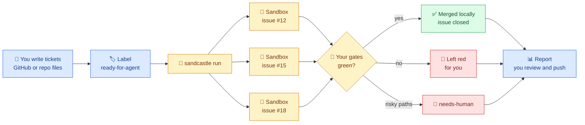
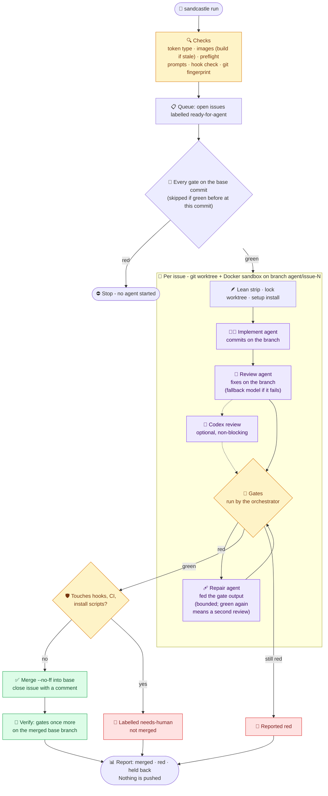

<div align="center">

# 🏰 sandcastle-kit

**Turn your ticket backlog into a software factory.**<br>
Unattended coding agents burn down your queue of GitHub issues or ticket files in Docker sandboxes - implemented, reviewed,
gated and merged while you are away from the keyboard.

[](https://github.com/mattpocock/sandcastle)
[](LICENSE)
[](.github/workflows/secret-scan.yml)
[](https://github.com/henkisdabro/sandcastle-kit/releases)

[](https://docs.anthropic.com/en/docs/claude-code)
[](https://github.com/openai/codex)
[](docs/INSTALL.md#-requirements)
[](https://nodejs.org)
[](tsconfig.json)
[](https://pnpm.io)

[Who it is for](#-who-is-this-for) · [Quick start](#-quick-start) · [Why](#-why-sandcastle-kit) · [Install details](docs/INSTALL.md) · [Set up a project](#-set-up-a-project) · [Mark tickets ready](#-how-to-mark-a-ticket-ready) · [Trackers](#-trackers-github-or-ticket-files) · [Run](#-run) · [Herdr](#-works-best-in-herdr) · [Updating](#-updating) · [Safety](#-safety-model) · [Troubleshooting](#-troubleshooting)

</div>

> [!NOTE]
> sandcastle-kit is an opinionated issue-burndown kit built on
> **[Sandcastle](https://github.com/mattpocock/sandcastle) by [Matt Pocock](https://github.com/mattpocock)**.
> Sandcastle does the heavy lifting - sandboxing, worktrees and agent orchestration. This kit is
> one way to put it to work, learned from and improved on with gratitude.

Sandcastle runs coding agents in Docker sandboxes. This kit turns it into a ready-made loop for
any repository whose tickets are GitHub Issues or Markdown files in the repo: it picks up tickets
marked `ready-for-agent`, has one agent implement each ticket and a stronger one review it, runs
your project's own lint/build/test gates itself (an agent never gets to say "tests pass"), merges
what is green and closes the ticket. One install serves all your projects; each project adds a
small config file.

## 🙋 Who is this for?

**In one line:** developers who already work with Claude Code or Codex, keep their to-do list as
tickets, and want the well-specified ones done while they are away from the keyboard.

**It is a good fit if you:**

- 🧑‍💻 are a solo developer, freelancer or small team with a backlog of clear, small-to-medium
  tickets - bug fixes, small features, refactors, test coverage, dependency and docs chores;
- 🗂️ track work in **GitHub Issues**, or as **Markdown files in the repo** (including the
  `.scratch/` layout from [Matt Pocock's skills](https://github.com/mattpocock/skills), if you use them - you do not have to);
- ✅ have real **gates** - lint, typecheck, tests, a build - that a machine can run. They are how the kit
  knows work is good, so the better your tests, the more you can hand over;
- 🖥️ have a Mac or Linux machine with Docker (or OrbStack, or Podman) and a Claude subscription or API key;
- 🌙 are happy to come back to a report and review what merged, rather than watch it happen.

**It is probably not for you if:**

- your tickets are vague ("make it faster", "improve onboarding") - an unattended agent with no chat
  context needs a closed spec, and the [queue step](#-queue-what-agents-work-on) helps you write one;
- the repo has no automated checks - nothing then stands between an agent's guess and your base branch;
- you want an agent pair-programming with you live (use Claude Code directly), or work that needs a
  production system, a device or a secret the sandbox must not have;
- your tickets live only in Linear, Jira or another tool. Linear issues can be *blockers* today, and
  the [tracker interface](#-trackers-github-or-ticket-files) is built for more, but only GitHub and ticket files are queues so far.

**What a day looks like:** in the morning you write or triage a handful of tickets and mark them
ready. You start a run and go about your day. When you are back there is a report: which tickets
merged into your local base branch (nothing is ever pushed), which are red and why, and which
need you. You review, push what you like, and repeat.

**Do I need anyone else's tools?** No, but one is recommended. The kit needs only Docker, Node, git
and, for GitHub tickets, the `gh` CLI. It also supports the workflow from
**[Matt Pocock's skills](https://github.com/mattpocock/skills)** - the same author as Sandcastle,
which this kit is built on - and we recommend installing them: `/grill-with-docs`, `/to-spec`
and `/to-tickets` are a good way to turn an idea into tickets an unattended agent can finish, and
`/triage` keeps incoming issues in shape. Run his `/setup-matt-pocock-skills` in your repo once
and the kit reads what it wrote (which tracker, which label), with no extra configuration. It stays
optional: skip his skills and one line in `config.ts` does the same job.

### 📖 The words used here

New to GitHub or to agents? These are the only terms you need.

| Word | Plain meaning |
|---|---|
| **Ticket** | One piece of work, written down: a title, a description of what should change, and how you will know it is done. On GitHub a ticket is an **issue**; in the files tracker it is a Markdown file. |
| **GitHub issue** | GitHub's built-in ticket: a page in your repository (the **Issues** tab) with a title, a description and a comment thread. |
| **Label** | A coloured tag you stick on a GitHub issue, such as `bug` or `ready-for-agent`. Labels are how this kit knows which issues to work on: it only touches the ones carrying its queue label. |
| **`ready-for-agent`** | The kit's default queue label. It means "an agent may do this without asking me anything". Putting it on a ticket is you saying yes. [How to add it](#-how-to-mark-a-ticket-ready). |
| **Queue** | Every ticket currently marked `ready-for-agent`. A run works through it. |
| **Gate** | A command that must pass before anything merges: your linter, type checker, tests, build. You list them once in `config.ts`. |
| **Sandbox** | A throwaway Docker container in which one agent works on one ticket, on its own git branch, so it cannot touch your machine or other tickets. |
| **Base branch** | The branch (usually `main`) that green work is merged into, locally. Nothing is pushed. |
| **`needs-human`** | Added by the kit when a change is risky or a ticket cannot be finished unattended. It takes the ticket out of the queue until you look. |

> [!TIP]
> **AI coding agent?** Start at [the section written for you](#-if-you-are-an-ai-coding-agent-reading-this), then run `sandcastle doctor`.

## ⚡ Quick start

**You need:** macOS or Linux, Node 22+, pnpm, git, the GitHub CLI signed in (`gh auth login`;
skippable if your tickets are files in the repo), and a container runtime - [OrbStack](https://orbstack.dev) or [Podman](https://podman.io) on
macOS, [Docker Engine](https://docs.docker.com/engine/install/) on Linux.
[Full requirements](docs/INSTALL.md#-requirements).

**1. Install the kit** (once per machine) - one line, paste it into your terminal:

```bash
git clone https://github.com/henkisdabro/sandcastle-kit.git ~/sandcastle-kit && cd ~/sandcastle-kit && pnpm install && ./bin/sandcastle setup
```

`setup` puts the `sandcastle` command on your PATH, installs the agent skill, walks you through
your Claude and GitHub tokens, and finishes with a health check. Re-run it any time.
([What it does, and doing it by hand](docs/INSTALL.md).)

**2. Point it at a project:**

```bash
cd ~/code/your-project
sandcastle init              # or ask your agent: /sandcastle init
sandcastle build
```

`init` fills in the gate commands (`lint`, `test`, ...) from your stack; check them against CI in
`.sandcastle/config.ts` - see [Set up a project](#-set-up-a-project).

> [!TIP]
> **Recommended, optional:** install [Matt Pocock's skills](https://github.com/mattpocock/skills) too
> and run `/setup-matt-pocock-skills` in your project. The kit understands the tracker and labels it
> records, and his `/grill-with-docs`, `/to-tickets` and `/triage` are a good way to write the tickets
> this kit works through. Nothing here requires them.

**3. Mark some tickets `ready-for-agent` - on GitHub that is a label you add to an issue ([step by step](#-how-to-mark-a-ticket-ready), no experience needed); in ticket files it is a `Status:` line ([Trackers](#-trackers-github-or-ticket-files)) - and try a dry run:**

```bash
DRY_RUN=1 sandcastle run     # implement, review, gate - never merge or close
```

---

## 💡 Why sandcastle-kit?

You already drive Claude Code or Codex every day - maybe with subagents, maybe several sessions
side by side. That still needs **you** in the loop: approving prompts, watching terminals, copying
context between chats. sandcastle-kit is the next step up.

- 🎫 **Your tickets stay where they are.** GitHub Issues or Markdown files in the repo: write a
  ticket an agent could finish with no chat context, mark it ready, and it joins the queue. No new
  tool to learn.
- 🏭 **A software factory per repository.** Each queued issue gets its own git worktree and its
  own Docker sandbox, several at once, across several projects.
- 🧪 **Proof, not promises.** The orchestrator - not the agent - runs your gates. Only green
  branches merge, and the merged branch is gated again.
- 🔒 **Safe to leave unattended.** Agents run with permission prompts off, but inside a container
  with a token that cannot push, and risky changes wait for a human.
- ☕ **You come back to a report**: what merged, what is red, what needs you. Nothing is pushed
  until you push it.



## ✨ What it adds to Sandcastle

| | Feature | What you get |
|---|---|---|
| 🚦 | **Gates run by the orchestrator** | Your lint/build/test, run after the agents, in the sandbox. Only green branches merge, and the merged base branch is gated once more. |
| 🧱 | **A green base first** | Every gate runs on the base commit in the image before any agent starts. A gate red there would be red on every branch, so the run stops before it spends anything. |
| 🩹 | **Repair on red** | A red gate gets one repair pass on the same warm sandbox, fed the gate's own output, then the gates run again - and up to two more while each pass turns up a failure the last one did not see. A branch a repair turned green gets the review pass again, on the repair commits, before it can land. |
| 🗂️ | **Your tracker** | Tickets are GitHub Issues (the default) or Markdown files in the repo - in the layout [Matt Pocock's setup skill](#-trackers-github-or-ticket-files) uses, so a repo that ran it works with no extra config. |
| 🔗 | **Issue dependencies** | `Blocked by #12` in an issue body holds it back until #12 is closed. It can also wait on a Linear issue (`ENG-42`) or an in-repo task file - see [Blockers](#-blockers-github-linear-ticket-files). |
| 🧑‍💻 | **Implement, then review** | Claude Sonnet 5.5 implements, Claude Opus 5.5 reviews, on the same warm sandbox; a failed review falls back to the implementer's model. Optional third review by an OpenAI model through Codex (`CROSS_REVIEW=1`). |
| 🪶 | **Lean sandboxes** | The project's skills, subagents, commands, MCP servers and plugins are hidden from sandbox agents unless you keep them, because each one costs context on every turn. |
| 🪝 | **Hooks enforced** | The project's Claude Code hooks are kept, and checked to be runnable in the image before any sandbox starts. |
| 🐳 | **One base image, a layer per project** | Rebuilt only when a Dockerfile or a Claude Code or Codex release changes. |
| 🛫 | **Preflight** | One short reply from every model before any sandbox starts, so an exhausted plan or a too-old CLI stops the run up front instead of halfway through. |
| ♻️ | **Picks up where it stopped** | A ticket re-run on its old branch gets the base merged in first (a conflict goes to the implementer, and old branches land first); a re-run on an old branch that was reviewed and green and has not moved since skips implement and review - a clean base merge goes straight to the gates, a conflicted one gets a short resolver prompt first; a re-run whose only change since its last review is the base merge gets a review of the merge alone, not a full review; a ticket closed, unqueued or sent to a human mid-run is left alone; tickets whose existing branches change the same file do not start together (the first runs, the others wait for the next run); a killed run's leftover sandboxes are stopped by the next run or `sandcastle clean`. |
| 🔒 | **Host safety** | Fine-grained tokens only, host git hooks off during a run, the shared `.git` fingerprinted, risky branches held for a human merge (see [Safety model](#-safety-model)). |
| ⚖️ | **Machine-wide limits** | Several projects can run at once without starving each other. |
| 📺 | **A live status view** | `sandcastle status` in any terminal: every ticket of the run and where it is - working, ready to land, needing you, queued, blocked, merged - which gate is running, and when landing should start. |
| 🖥️ | **Best in [Herdr](https://herdr.dev)** | The run opens its own tab: the status view and a pane per sandbox, each shown in Herdr's agent sidebar as working, done or blocked - see [Works best in Herdr](#-works-best-in-herdr). |
| 🧩 | **An agent skill** | `/sandcastle` in Claude Code, `$sandcastle` in Codex, also read by OpenCode - for setup, issue triage, starting runs and updating. |

## 🔄 How it works

A run starts in a project, on its base branch, with a clean tree. It checks everything first,
then fans out one sandbox per issue, up to `CONCURRENCY` at once and within the machine-wide limit.



A green gate run proves only that the configured gate commands passed on that branch - no more than those commands check. Whether the change does what the ticket asked is checked by the review agent, not the gates, which is why every branch is reviewed before it is gated and a repaired branch is reviewed again. A live run rarely reaches the repair path, because agents run the gates themselves before they finish. `SANDCASTLE_TEST_RED_GATE=1` (see the [Configuration](#-configuration) table) counts each issue's first gate run as red to exercise it, at the cost of one repair pass per issue.

## 🧱 Set up a project

From the project's root, on its base branch:

```bash
sandcastle init      # writes .sandcastle/config.ts, rules.md, .gitignore; prints the lean check
```

`init` reads the stack from the repo root - `package.json` (with its lockfile and scripts),
`pyproject.toml` + `uv.lock`, `go.mod` or `Cargo.toml` - and fills in the gates and setup from it.
Where the base image lacks the toolchain (uv, Go, Rust, Bun) it also writes
`.sandcastle/Dockerfile`. Treat what it writes as a starting point. Anything else, poetry and pipenv
included, gets a placeholder gate that fails until you copy in what CI runs.

Then edit, in this order:

0. **Where do your tickets live?** Nothing to do for GitHub Issues. For Markdown tickets set
   `tracker: "files"` in `config.ts` (or let the kit read `docs/agents/issue-tracker.md` if you
   ran [Matt Pocock's setup skill](https://github.com/mattpocock/skills), recommended but optional). `sandcastle queue` shows which tracker the kit chose and why;
   see [Trackers](#-trackers-github-or-ticket-files).
1. **`.sandcastle/config.ts`** - `gates` (the commands CI runs: lint, typecheck, build, test),
   `setup` (dependency install in the sandbox), `mounts` (e.g. the host package store), `lean`.
   See [Configuration](#-configuration).
2. **`.sandcastle/rules.md`** - what an agent in *this* repo must read first, must never do
   (deploys, production databases), and how a visual or data change is proven. It is added to
   the implement, review and repair prompts, and reaches only those agents: the landing merge is
   the kit's own `git merge`, so rules do not reach it (see
   [a branch conflicts at landing](#-troubleshooting)).
   `init` leaves three questions there for you to answer - which committed files a command
   writes (also `generated` in `config.ts`), which paths an agent must never touch, and which gate
   catches drift in generated files (see [A gate for generated files](#-a-gate-for-generated-files)) -
   and the `/sandcastle` skill's init action asks them for you.
3. **`.sandcastle/Dockerfile`** - only if the gates need something the base image lacks (browsers,
   Python tooling, a pinned package manager). Start from `templates/Dockerfile` in the kit.
4. **Lean and hooks** - `sandcastle lean` lists what the repo would load into each sandbox and
   checks every kept hook. Keep nothing unless a run needs it; drop only host-only hooks.

```bash
sandcastle build             # base image, then the project layer
sandcastle lean              # lean table + hook check (no model calls)
sandcastle gates             # every gate on the base commit in the image (no model calls)
sandcastle preflight         # one reply per model (spends a little allowance)
```

Commit `config.ts`, `rules.md`, the Dockerfile and `.sandcastle/.gitignore` in the project.

### 🧪 A gate for generated files

When the repo commits files that a build generates (minified CSS, a data file built from JSON, a
sitemap), a gate should prove they match the sources. Otherwise a branch can land sources and
generated output that disagree. A reviewer that finds a change no gate exercises says so, and the
closing summary lists the ticket under Needs you as `merged - check by hand`, with what to check.

Gates run under `sh -c` in the sandbox (dash on Debian), so write the recipe in POSIX sh. This one
names the build's outputs in `OUT`, runs the build, records which of those paths changed, restores
only those paths and fails, listing them, if any differed:

```ts
gates: [
  {
    name: "generated-in-sync",
    command:
      "OUT='dist/site.css data/index.json dist/sitemap.xml'; pnpm run build || exit 1; diff=$(git status --porcelain -- $OUT ':!dist/sitemap.xml'); git checkout -- $(git ls-files -- $OUT); git clean -fdq -- $OUT; if [ -n \"$diff\" ]; then echo \"$diff\"; echo 'Generated files differ from the commit: run the build and commit them.' >&2; exit 1; fi",
  },
],
```

- Never restore with `git checkout -- .`. The gate runs in the agent's branch worktree, and that
  would discard any other uncommitted file there. `git checkout` also stops without restoring
  anything if a path it is given is not tracked yet, so the recipe hands it only
  `git ls-files -- $OUT`; `git clean` removes new, untracked output.
- The `:!path` exclusion is for output that changes on every build (a sitemap `lastmod`). Making
  the build deterministic, for example by dating `lastmod` from the last commit, is better than
  excluding it.
- `OUT` is split on spaces, so paths with spaces need listing differently.

Declare the same files under `generated` in `.sandcastle/config.ts`, with the command that writes
them: `generated: [{ paths: ["dist/"], regen: "pnpm build" }]`. A branch from an earlier run whose
base merge conflicts only in them is then merged by regenerating, with no agent; the drift gate
still proves the result matches the sources. At landing, a branch whose merge conflicts only in
`generated` paths is merged in a throwaway sandbox by regenerating them, committed with the usual
`Merge agent/issue-N (closes #N)` message, and the merged base is gated again in the verify step. Before the base moves, the host checks that the
commit is a merge of exactly the base tip and the gated head and changes nothing beyond a plain merge
except under `generated` paths; otherwise nothing lands and the ticket is left as a conflict.

## 📋 Queue: what agents work on

The queue is every open ticket marked `ready-for-agent` (a GitHub label, or a ticket file's `Status:`;
the value is `label` in `config.ts`). Mark a ticket only when an agent with no chat context could finish it from the issue and its comments,
and your gates could prove it. The `/sandcastle queue` skill action walks every open issue,
gathers the facts, asks you the open decisions in batches, writes each decision on its issue, then
labels it. No issues yet? `/sandcastle audit` reviews the repo with read-only agents and files what they find, ready to queue.

An issue that has to wait for another says so in its body: `Blocked by #12` or `Depends on #12`.
A run skips it while #12 is open - even when #12 is in the same run, because the dependent
would branch before #12 lands - and the next run picks it up. A blocker can also live outside
GitHub; see [Blockers](#-blockers-github-linear-ticket-files).

### 🏷️ How to mark a ticket ready

**On GitHub** (the default):

1. **Create the label once per repository.** In the repo, open **Issues > Labels > New label**
   and name it exactly `ready-for-agent` (or run
   `gh label create ready-for-agent --description "Ready for an unattended agent" --color 0E8A16`).
   If your team already uses another name, set `label` in `config.ts` instead.
2. **Put it on an issue.** Open the issue, click the gear next to **Labels** in the right-hand
   sidebar and tick `ready-for-agent`. From a terminal: `gh issue edit 12 --add-label ready-for-agent`.
3. **Take it off to pull the ticket back.** The kit removes the label itself when it finishes.

**In ticket files:** add a line `Status: ready-for-agent` directly under the ticket's title and
commit it. See [Trackers](#-trackers-github-or-ticket-files).

**Before you do, check the ticket is ready.** An agent has only the ticket and the code, never your
chat. A good one says what should change, where to look, and how you will know it worked ("the
signup form rejects an empty email; `pnpm test` covers it"). If you are unsure, the
`/sandcastle queue` skill action reads your open issues with you and only labels the ones that
qualify.

Where the queue lives is your choice - see [Trackers](#-trackers-github-or-ticket-files). Blockers
can also be Linear issues or ticket files.


### 🧷 Blockers: GitHub, Linear, ticket files

Only the ticket **body** is read: a `Blocked by ...` line in a comment does nothing, and a run
starts the ticket anyway. Both `sandcastle run` and `sandcastle blockers` warn about that, and about
comments whose blockers are all closed (stale).

| Named in the body | Waits until | Enable |
|---|---|---|
| `Blocked by #12`, `Depends on #12` | issue or pull request #12 is closed or merged | always on |
| `Blocked by ENG-42` | the Linear issue is in a *completed* or *canceled* state | `blockers.linear: ["ENG"]` and `LINEAR_API_KEY` |
| `Blocked by .scratch/checkout/issues/03-pay.md` | that file on the base branch has `Status: done` | the files tracker, or `blockers.files: { dir }` |
| `Blocked by: 01, 02` (a header line in a ticket file) | those tickets of the same feature are done | the files tracker |

Several may share a line: `Blocked by #12, ENG-42 and .scratch/checkout/issues/03-pay.md`.

Write the line as plain text. One inside a code block or inline code (backticks) is an example, not a blocker, so a ticket can quote blocker lines without waiting on them.

```ts
// .sandcastle/config.ts
blockers: {
  linear: ["ENG", "OPS"],                             // Linear team keys
  files: { dir: ".scratch", done: ["done", "shipped"] }, // where ticket files live; done defaults to done, closed, resolved, wontfix
},
```

- **Linear** needs a personal API key (read-only is enough) as `LINEAR_API_KEY` in
  `~/.config/sandcastle-kit/.env`, not the project's `.sandcastle/.env` (Sandcastle forwards that
  file into every container, so the kit refuses the key there). It stays on the host. `sandcastle doctor` checks it when `blockers.linear` is set.
- **Ticket files** are read from the base branch, not your working tree, so a blocker counts as done
  once its `Status:` change is committed there. Front matter (`status: done`) is read too.
- **Unreadable = open.** A missing Linear key, a network error or a missing file holds the ticket
  back; guessing wrong would start work on a missing foundation.

## 🗂️ Trackers: GitHub or ticket files

A tracker is where tickets live. The kit ships two:

| Tracker | Tickets are | Queue | Done |
|---|---|---|---|
| `github` (default) | GitHub Issues, through `gh` | open issues with the `label` | closed, label removed |
| `files` | Markdown files `.scratch/<feature>/issues/<NN>-<slug>.md` | files whose `Status:` equals the queue value | `Status: done`, committed on the base branch |

**Which one a project uses**, first match wins:

1. `tracker` in `.sandcastle/config.ts`: `"github"`, `"files"`, or `{ type: "files", dir: "tickets", done: [...] }`.
2. **Matt Pocock's setup, if the repo has it.** [`/setup-matt-pocock-skills`](https://github.com/mattpocock/skills)
   writes `docs/agents/issue-tracker.md` (`# Issue tracker: GitHub` or `Local Markdown`) and
   `docs/agents/triage-labels.md`. The kit reads both: the tracker from the first, and the queue
   value from the row that maps `ready-for-agent`, so a repo that renamed that label needs no `label`
   setting. GitLab and "other" trackers are noticed and reported by `sandcastle doctor`; the kit falls
   back to GitHub.
3. GitHub.

**Matt Pocock's skills are supported and recommended, never required.** Install
[his skills](https://github.com/mattpocock/skills) and run `/setup-matt-pocock-skills` in the
project: that writes `docs/agents/`, the kit detects it, and tickets that `/to-tickets` writes
(`.scratch/...`) or issues that `/triage` labels `ready-for-agent` are picked up as they are - the
skills plan and shape the work, the kit burns it down unattended. Without them, `tracker: "files"`
and a `.scratch/` folder (or plain GitHub Issues) is the whole setup.

**The files layout** (Matt's "Local Markdown"):

```markdown
# Add the cart

Status: ready-for-agent
Blocked by: 01

What to build...

## Comments

### 2026-09-30 - sandcastle
Merged by the Sandcastle loop from `agent/issue-checkout-02`...
```

Keep `Status:` and `Blocked by:` as plain lines directly under the title, together: only that
block is read, so a "Status:" in the description below is just text. A value may be in backticks;
`Blocked by:` takes bare numbers (`01, 02`) for tickets of the same feature.

A ticket is named by its feature and number: `checkout-02` in branches (`agent/issue-checkout-02`),
logs and the status view. `sandcastle queue` lists the queue and what holds each ticket back;
`sandcastle doctor` says which tracker was chosen and why.

**Who writes to the tracker.** With GitHub, agents comment and label themselves, as before. With
`files`, agents write nothing to the tickets: they end with `<report>...</report>` (or
`<blocked>...</blocked>` to hand the ticket to a human), and the orchestrator posts it, commits it to
the base branch and marks the ticket `done` or `needs-human`. That keeps ticket files out of the
agents' branches, and the GitHub token out of the sandbox when nothing needs it (a `files` project
does not require `GH_TOKEN`).

**Limits.** The `files` tracker needs the run to start from a clean base branch (it commits ticket
changes there). Linear as a full tracker is not built; Linear issues work as blockers today.


## 🚀 Run

```bash
sandcastle run                        # every queued issue
ISSUES=12,15 sandcastle run           # just these
sandcastle run 12 15                  # the same, as arguments
DRY_RUN=1 sandcastle run              # implement, review, gate - never merge or close
sandcastle run --dry                  # the same, as an argument
CONCURRENCY=2 sandcastle run          # parallel sandboxes for this run
sandcastle run --concurrency 2        # the same, as an argument
CROSS_REVIEW=1 sandcastle run         # add the Codex review
```

A run refuses to start on a dirty tree, off the base branch, while another run of the same
project is live, or while any check fails. The status view opens first, before the image check,
preflight and base gates, and its run line names the stage the run is in. Inside Herdr the run
lays it out itself (below), and does not start if it cannot; elsewhere run `sandcastle status` in
a second terminal. While agents work, the run prints a heartbeat line every five minutes, and the
status view flags a sandbox whose log has been quiet for ten. Every step - image, preflight, base
gates, each agent pass and gate run - is timed into `.sandcastle/logs/timings.jsonl`, with each
agent pass's tokens and each gate's own time (`ok` is false for a gate run with a red gate, named
in `red`); the report gives each issue's wall time and tokens, and the base check prints its gates
slowest first. Tickets that others wait for start first. Each agent pass also keeps its raw stream -
every tool call and result, as the agent printed it - in
`.sandcastle/logs/agent-issue-<id>-<phase>-<id>.jsonl` beside the readable `.log`, archived with it.
Before the slow steps a run prints a rough estimate - tokens and time for the chosen tickets, from the medians of this project's earlier tickets in `.sandcastle/logs/timings.jsonl` - once the project has any; with `USAGE_CHECK=1` it also prints the plan's usage after preflight.

The status view reads each ticket of a live run from the run's own record, so it always agrees
with the run:

| State | Means |
|---|---|
| `setup` `impl` `review` `codex` `gates` `repair` | Working. `gates` names the gate running (`2/7 pytest`) or says it waits for a machine-wide gates slot; its output is in `.sandcastle/logs/agent-issue-<id>-gates-<id>.log`. AGE turns red at twice the step's usual time in this project |
| `ready` | Implemented, reviewed, gates green: lands when the run ends. `human merge: .github/` means it will be held for a person instead |
| `landing` | Being merged; the run line counts landing down (`landing 6/25`) |
| `gate red` `conflict` `held` `crashed` `not landed` | Needs you. A conflict names the files and the branch merged before it that changed them; `held` with no commits is a ticket handed back to a person |
| `stopped` `orphaned` | Needs you. `stopped`: finished, but the run stopped before landing (it says why, and lands on the next run). `orphaned`: its run was killed and its container still works - `sandcastle clean` or the next run stops it |
| `withdrawn` | Closed, taken out of the queue or marked `needs-human` during the run - someone's decision. Not landed, and not started if it came before its sandbox |
| `queued` `blocked` | Not started: next to start, how many ahead, or what it waits for and whether this run holds that blocker |
| `merged` `no change` `skipped` | Done, found nothing to do, or not started because the run stopped early |

Green branches land when every sandbox has finished, not as each passes: landing moves the base
branch, which the run guards against sandboxes changing, and a ticket-file tracker commits there.
So a dependant of a ticket in this run always waits for the next run. A dry run ends by
checking that its issues are unchanged on GitHub. Every run ends with a closing summary, in the
order you act on it: done, held for you, needs fixing (with the files or tests, and causes several
branches share), runnable now or still blocked (blockers re-read after landing), local state
(commits not on the upstream - the issues are closed but the code has not left your machine) and
the next step. `sandcastle report` prints it again. Afterwards, push the base branch yourself when
you are happy with it; `sandcastle clean` clears leftover worktrees and branches.

> [!TIP]
> Start with `DRY_RUN=1` on a couple of issues to see the whole loop - implement, review, gates -
> without anything being merged or closed.

### 😴 Sleep

A machine that goes to sleep pauses every sandbox mid-task, so by default a run keeps it awake
until the run ends - `caffeinate -i` on macOS, `systemd-inhibit` on Linux - and prints
`Keep awake: on` when it starts. The display can still turn off and the screen still locks. The
helper is tied to the run's process, so it stops when the run ends, crashes or is killed.

- **One run on your energy settings:** `KEEP_AWAKE=0 sandcastle run`.
- **Always:** add `"keepAwake": false` to `~/.config/sandcastle-kit/config.json`.
- **A laptop lid is the exception.** Closing it sleeps a MacBook whatever the kit does, unless it is
  on power with an external display attached. Leave the lid open, or run on a desktop machine.

It is a machine setting, not a project one: `.sandcastle/config.ts` is committed, and would
decide it for every teammate's machine.

## 🪟 Works best in Herdr

sandcastle-kit runs anywhere, but it is built to be watched from [Herdr](https://herdr.dev), the
terminal multiplexer for coding agents. Start `sandcastle run` in a Herdr pane and the run lays
out its own view:

- 🗂️ **A tab of its own.** Started in a fresh tab where it is the only pane (what the skill
  does), the run adopts that tab, names it `sandcastle <project>` and puts the status view beside
  its own output. Started anywhere else, it opens that tab itself and the tab you launched from
  gets nothing new. Either way one pane per concurrent sandbox stacks on the right, named after
  its issue and following that sandbox's log through implement, review, gates and repair. Once
  nothing is left to start, each pane closes as its sandbox finishes (a crashed one stays open). The
  run prints `Status view: pane <id> (tab <id>)`.
- 🚦 **Agent states in the sidebar.** Herdr cannot see an agent inside a container, so the run
  reports each sandbox's phase to Herdr itself: *working* while it implements, reviews or gates,
  *done* when its pipeline finishes - ready to land or red, the outcome is in the message - and
  *blocked* only when a human has to act: a crash, a merge conflict, a branch held for a human
  merge. The tab and workspace badges roll the states up, so a glance at the sidebar says whether
  a run needs you.
- 🔔 **A notification** with the run's summary when it ends. Outside Herdr too: `"notify": ["notify-send", "Sandcastle"]` (or `osascript`, `curl` to ntfy - any command, as a list of arguments, not a shell string) in `~/.config/sandcastle-kit/config.json` runs when a run ends, with `SANDCASTLE_NAME`, `SANDCASTLE_SUMMARY` (for example `run finished - 3 merged, 1 need you, 2 need fixing, of 6`) and `SANDCASTLE_EXIT` set. It gets ten seconds; if it fails, the run's result stands.

When the run ends its sandbox panes close, so nothing in the sidebar outlives it; the status view
stays, showing each branch's outcome, and the next run replaces it rather than stacking another. Outside Herdr none of this happens and nothing else changes - watch with
`sandcastle status` in a second terminal. `SANDCASTLE_HERDR_VIEW=0` skips the tab; the status
view then opens in a pane beside yours.

The status view gets about half the screen: run pane 25%, status view 50%, sandboxes 25% in one
column of equal rows (status below the run pane on a narrow screen; 2/3 in a tab of its own).
Once it is open, Herdr switches to the run's tab; `SANDCASTLE_HERDR_FOCUS=0` leaves your focus
where it is.

```
┌ you ───────────────────────────────────┐   tab "sandcastle my-app"
│ your agent / shell                     │   ┌ sandcastle my-app ───────┬ #12 Add rate limiter ──┐
│ $ sandcastle run                       │   │ #12 ● review   3m  2 ... │ Bash(pnpm test)        │
│ 2 issue(s), 2 at a time ...            │   │ #15 ● impl     1m  0 ... │                        │
│ Gates on main: lint=pass test=pass     │   │ #18 ○ queued   not in .. ├ #15 Fix date parsing ──┤
│ [impl-12] Started ...                  │   │                          │ Edit(src/date.ts)      │
└────────────────────────────────────────┘   └──────────────────────────┴────────────────────────┘
                                              sidebar: #12 review ● · #15 implement ●
```

## 📥 Updating

In each project, ask your agent for `/sandcastle update`. It pulls the kit, rebuilds the images,
re-runs the hook check, and walks you through anything in [`CHANGELOG.md`](CHANGELOG.md)'s
**Upgrading** notes that affects that project. Existing configs keep working: a new field is
always optional. [By hand](docs/INSTALL.md#-updating).

## 🧰 Commands

| Command | What it does | Calls the model? |
|---|---|---|
| `sandcastle setup` | Interactive install: links the command and skill, writes the credentials file, runs doctor | ➖ no |
| `sandcastle doctor [--verify]` | Checks machine and project setup; prints the fix for each problem as the command that applies it (doctor itself changes nothing). `--verify` also asks GitHub and Anthropic whether the tokens are accepted (a fingerprint, never the value; no model call, no allowance spent); prints the Claude Code and Codex versions the image will get (warning, never failing, when the release channel could not be reached), and, inside a project, warns when the base image was built more than 30 days ago (`sandcastle build --force` fixes it) | ➖ no |
| `sandcastle init` | Scaffolds `.sandcastle/` in the current project with gates guessed from its stack, then the lean check | ➖ no |
| `sandcastle build [--force]` | Builds `sandcastle-base:<hash>` and `sandcastle-<name>:<hash>`; prunes superseded tags. `--force` also pulls the base OS image afresh (Debian and Node security updates); ordinary builds and runs never pull | ➖ no |
| `sandcastle lean [--measure]` | Lists skills/agents/commands/MCP/plugins (hidden or kept) and hooks (kept or dropped); checks kept hooks in the image. `--measure` runs one real turn with and without the extras | 💸 only with `--measure` |
| `sandcastle gates` | Every gate on the base branch, in a sandbox set up as an agent's is; prints each gate's command with its result. A run does the same first and stops on red; full output in `.sandcastle/logs/base-gates.log` | ➖ no |
| `sandcastle land <ticket>` | Merges one `agent/issue-<n>` branch into the base the way a run does (`Merge agent/issue-N (closes #N)`), gates the merge in a sandbox, then closes the ticket. Refuses a branch that changes hooks, CI or install scripts; on a conflict or a red gate merges nothing. A conflict only in `generated` paths is resolved by regenerating them | ➖ no |
| `sandcastle preview` | Dry-merges every unlanded `agent/issue-*` branch onto the base, oldest first, in the project image (`git merge-tree`; the host keeps git 2.31), and lists each as clean or conflicting with the files. Changes no checkout and no ticket | ➖ no |
| `sandcastle report` | The last run's closing summary: done, needs you (held), needs fixing (with causes several branches share), runnable now and still blocked (re-read after landing), local state (commits not on the upstream, branches left standing) and the next step. Every run also ends with it | ➖ no |
| `sandcastle queue [--json]` | The queue and what holds each ticket back, from whichever tracker the project uses. The status view reads the `--json` form | ➖ no |
| `sandcastle requeue <ticket> [--note "..."]` | Puts a ticket back in the queue and takes `needs-human` off, commenting the note first; on a ticket still queued it only adds the note. GitHub or ticket files (a ticket-file requeue is a commit to the base branch, so it refuses while a run of the project is live) | ➖ no |
| `sandcastle blockers` | Lists open queued issues whose comments say "blocked by" while the body does not (a run would start them), and comments whose blockers are all closed. Reads GitHub, and Linear if configured | ➖ no |
| `sandcastle preflight` | One "Reply OK" from every model, in the project image | 💸 yes, briefly |
| `sandcastle run` | The burndown (above) | 💸 yes |
| `sandcastle status [secs] [all]` | Live view, fitted to its pane with the overflow summarised on one line; `0` prints every row once | ➖ no |
| `sandcastle clean [--all]` | Stops any sandbox a killed run left working, removes leftover sandbox worktrees and finished `agent/*` branches; lists unmerged ones, which `--all` deletes too. Refuses while a run is live | ➖ no |

## 🔧 Configuration

`.sandcastle/config.ts` in each project exports a plain object:

| Field | Default | Meaning |
|---|---|---|
| `name` | required | Names the project image (`sandcastle-<name>`) and the status view |
| `gates` | required | `[{ name, command }]`, run in order, stopping at the first red |
| `baseBranch` | `"main"` | Branch agents start from and green work merges into |
| `tracker` | detected, else `"github"` | `"github"`, `"files"` or `{ type: "files", dir, done }` - see [Trackers](#-trackers-github-or-ticket-files) |
| `label` | `"ready-for-agent"` | The queue label (GitHub) or `Status:` value (files). Read from `docs/agents/triage-labels.md` when unset and that file exists |
| `concurrency` | `4` | Parallel sandboxes for this project (inside the machine-wide limit) |
| `autonomy` | `0` | Turns (runs) one `sandcastle run` may make. `0`: one, as ever. `1`: after each turn, list the re-runnable tickets and ask before running again (a yes at a terminal; with no terminal nothing re-runs). `2`: one automatic re-run. `3`: up to two. Re-runnable: tickets that ended in a merge conflict, and tickets whose blockers have landed (held tickets included). A re-run takes only those tickets, never the rest of the queue. Dry runs, stopped runs, runs that hit a usage limit and runs with red gates together never re-run |
| `claudeCode` | `"latest"` | Which Claude Code the sandbox image installs: `"latest"` or `"stable"` (the release channels, resolved on the host) or an exact version such as `"2.1.285"` to pin. `CLAUDE_CODE_VERSION` in the environment overrides it for one command |
| `dockerfile` | none | Project layer on the base image; starts `ARG BASE=sandcastle-base:latest` / `FROM ${BASE}` |
| `mounts` | `[]` | Extra bind mounts `{ hostPath, sandboxPath, readonly? }` |
| `setup` | `[]` | Commands run in each sandbox before the agents (dependency install) |
| `blockers` | none | `{ linear?: string[], files?: { dir, done? } }` - what a ticket may wait for besides a ticket on its own tracker; see [Blockers](#-blockers-github-linear-ticket-files) |
| `rules` | none | Markdown file added to the implement, review and repair prompts under "Project rules" |
| `lean.keep` | `[]` | Items sandboxes keep: `skill:<name>`, `agent:<name>`, `command:<name>`, `mcp:<server>`, `codex-skill:<name>`, `codex-config` |
| `lean.dropHooks` | `[]` | Substrings of hook commands to drop - host-only conveniences only |
| `hookTests` | `[]` | `[{ name, tool, input, expect: "block" \| "allow" }]` - proof that the kept PreToolUse guards fire (see [Hook tests](#hook-tests)) |
| `protectedPaths` | `[]` | Extra paths a branch may not change and still merge automatically |
| `land` | `"merge"` | How green work lands: `"merge"` (a merge commit; the branch's commits kept) or `"squash"` (one commit per ticket, subject `Merge agent/issue-N (closes #N)`; the agent branch is deleted once landed). Held branches are never landed either way |
| `generated` | `[]` | `[{ paths, regen }]` - committed files a command writes. A base merge into a branch from an earlier run, and a merge at landing, that conflicts only in these paths takes either side, reruns `setup`, runs `regen` in the sandbox and commits; any other conflict is left for the implementer (at landing, as a conflict). See [A gate for generated files](#-a-gate-for-generated-files) |
| `implement` / `review` | kit models, `high` effort, 8 / 3 iterations, 2400 s idle | `{ model, effort, maxIterations, idleTimeoutSeconds }` per agent. The `IMPL_*` / `REVIEW_*` env vars override `model` and `effort` for one run |
| `repair` | 1 attempt, 4 iterations, 2400 s idle | `{ attempts, maxIterations, idleTimeoutSeconds }` - passes the implementer's model gets to fix a red gate from its output (`maxIterations` and `idleTimeoutSeconds` also bound the resolver that finishes a conflicted base merge on a branch already reviewed and green); up to two more while each pass turns up a different failure, never the same one twice. `attempts: 0` turns it off. A gate that timed out is never repaired. A repair that commits and turns the gates green is followed by a second review pass (the review model, on the repair commits) and, if that commits, one more gate run. A re-run whose only change since its last review is the base merge (and any conflict resolution inside it) gets a review of the merge alone, not a full review |

Examples: [`examples/`](examples/).

<details>
<summary><b>Environment variables</b></summary>

| Variable | Default | |
|---|---|---|
| `IMPL_MODEL`, `IMPL_EFFORT` | `claude-sonnet-5-5`, `high` | The implementer |
| `REVIEW_MODEL`, `REVIEW_EFFORT` | `claude-opus-5-5`, `high` | The reviewer |
| `CROSS_REVIEW=1`, `CROSS_REVIEW_MODEL`, `CROSS_REVIEW_EFFORT` | off, `gpt-6-astra`, `high` | Codex review, signed in with a read-only copy of `~/.codex/auth.json` |
| `ISSUES`, `CONCURRENCY`, `DRY_RUN` | queue label, config, off | Per run |
| `AUTONOMY_LEVEL` | config, else `0` | Overrides `autonomy` for one run (`0` turns a configured level off) |
| `CLAUDE_CODE_VERSION`, `CODEX_VERSION` | `latest`, npm's `latest` | The Claude Code channel or version, and the Codex version, the image installs (see "The image's agent versions") |
| `SKIP_PREFLIGHT=1` | off | Skip the model check |
| `SKIP_BASE_GATES=1` | off | Start agents even though the gates were not checked on the base commit - for a known flaky gate, say |
| `SANDCASTLE_HERDR_VIEW=0` | on inside Herdr | Skip the per-sandbox Herdr tab (the status pane still opens; inside Herdr a run that cannot open any status view does not start) |
| `SANDCASTLE_HERDR_FOCUS=0` | on inside Herdr | Leave your focus where it is instead of switching to the run's tab once its status view opens |
| `SANDCASTLE_TEST_RED_GATE=1` | off | Test the repair path: each issue's first gate run counts as red, so a repair pass runs and the gates are re-run. Costs a repair pass per issue; ignored when `repair.attempts` is 0 |
| `USAGE_CHECK=1`, `USAGE_STOP` | off, `90` | Read the Claude plan's usage windows before each issue starts, and start no new issue once one reaches `USAGE_STOP` percent. Needs `CLAUDE_CODE_OAUTH_TOKEN`. The endpoint is undocumented and rate-limited, so an unknown reading never blocks a run |
| `SANDCASTLE_MAX_SANDBOXES`, `SANDCASTLE_MAX_GATES` | 6, 2 | Machine-wide limits (also `~/.config/sandcastle-kit/config.json`: `{"maxSandboxes": 6, "maxGates": 2}`) |
| `KEEP_AWAKE=0` | on | Let the machine sleep during a run, as its energy settings say (also `"keepAwake": false` in `config.json`). [Sleep](#-sleep) |
| `"notify": ["notify-send", "Sandcastle"]` in `config.json` | off | Outside Herdr too: runs when a run ends, with `SANDCASTLE_NAME`, `SANDCASTLE_SUMMARY` (for example `run finished - 3 merged, 1 need you, 2 need fixing, of 6`) and `SANDCASTLE_EXIT` set. Any command, as a list of arguments, not a shell string (`["sh", "-c", "notify-send Sandcastle \"$SANDCASTLE_SUMMARY\""]` if you want one). It gets ten seconds; if it fails, the run's result stands |

A project that always wants different models or effort sets them in `.sandcastle/config.ts`
(`review: { effort: "medium" }`); the env vars are for one run. Effort levels are `low`,
`medium`, `high`, `xhigh`, `max`. Anthropic suggests `medium` as a
starting point for agentic coding on both 5.5 models; the kit defaults to `high` for quality.
Measure before changing it.

One ticket can ask for a different implementer: a GitHub label `model:<id>` (`model:claude-opus-5-5`) and/or `effort:<level>` on the issue sets the implement and repair passes for that ticket only, over `IMPL_*` and `config.ts`. The run lists the override next to the ticket, checks the label before anything starts, and preflight asks that model for a reply too. Reviews keep the project's pair. Ticket files have no labels, so this is GitHub-only.

</details>

### 🐳 The image's agent versions

Claude Code ships almost daily, so the base image follows its `latest` release channel instead of a
version written into the Dockerfile: the kit resolves the version on the host when it ensures the image
(`sandcastle build`, and the start of every run) and makes the Claude Code and Codex versions part of
the image's tag. A release therefore triggers one rebuild, of about a minute, and every sandbox of a
run has the same version. Codex follows npm's `latest` the same way. A run's start lines and
`sandcastle build` print `Claude Code <version> (<channel>) · Codex <version>`, and `run.json` records them.

- **Pin** if a release misbehaves: `claudeCode: "2.1.285"` in `.sandcastle/config.ts`, or
  `CLAUDE_CODE_VERSION=2.1.285` for one command; `CODEX_VERSION=0.159.2` pins Codex. `claudeCode: "stable"`
  follows the slower channel.
- **Offline**: the resolved pair is cached for six hours in `~/.cache/sandcastle-kit/versions.json`
  (`$XDG_CACHE_HOME` when set). If the channel cannot be reached, the cached value is used whatever its age,
  and with no cache the defaults in `docker/base.Dockerfile`, with one line saying so. A run never fails
  for a network error here.

## 🪶 Lean sandboxes and hooks

A sandbox has no user-level `~/.claude`, so the project's own Claude Code config is everything an
agent loads - and each skill description and MCP tool schema is paid on every turn. Before the
agent starts, each worktree loses `.claude/skills`, `.claude/agents`, `.claude/commands`,
`.agents/skills` (read by Codex), `.mcp.json`, `.codex/config.toml`, and the plugin, marketplace,
MCP-enable and status-line keys of `.claude/settings.json`. Permissions and `env` stay. The
changes are marked skip-worktree, so an agent can never commit them. `lean.keep` brings items
back. `sandcastle lean` (and every run) warns when a hidden item is named by a file the sandbox
keeps - a test that reads a skill file, say, would fail on every branch until the item is kept. On a real project this saved ~2,500 input tokens per agent turn.

**Hooks are the opposite: kept.** They cost no context and are how a repo enforces its rules -
guards, linters, test gates, audit logs. `lean.dropHooks` removes host-only conveniences (a token
compressor, a preview server, a notification), never a guard. Before any sandbox starts, every
kept hook is checked in the image: executable on PATH, scripts present, Python compiles, top-level
imports resolve. A failing hook stops the run; fix it in the project's Dockerfile. Hooks in the
untracked `.claude/settings.local.json` never reach a sandbox, and the check warns about them. Git
hooks run on agent commits inside the sandbox as usual. The Codex review does not run Claude Code
hooks.

### Hook tests

The check above proves a hook *can* run, not that it blocks anything. A guard that never fires
and a guard that allowed a harmless call look the same in an agent's log, and a guard whose
Python module is missing exits 1 - which Claude Code treats as a non-blocking error, so the guard
fails open. `hookTests` closes that gap without a model call. Each test is a made-up tool call:

```ts
hookTests: [
  { name: "brand guard refuses an unapproved claim", tool: "Write",
    input: { file_path: "specs/example.json", content: "{\"headline\": \"Guaranteed #1 results\"}" },
    expect: "block" },
  { name: "ordinary edit is allowed", tool: "Edit",
    input: { file_path: "README.md", old_string: "a", new_string: "b" }, expect: "allow" },
],
```

`sandcastle gates` and every run's base check hand it, on stdin and exactly as Claude Code would,
to each kept `PreToolUse` hook whose matcher takes that tool - in the base-gate sandbox, after
`setup` has installed what the hooks import. `block` passes when at least one of them blocks
(exit 2, or a JSON `deny`); `allow` passes when none does. The call itself never happens. A failed
test is a red base gate: the run stops before any agent starts. `sandcastle lean` warns when
guards are kept and no test exists.

## 🔒 Safety model

Agents run unattended with permission prompts off, inside Docker. The container is the boundary,
and the kit narrows what can cross it:

- 🔑 **Tokens.** Only a fine-grained GitHub token (issues and metadata on chosen repos) enters the
  sandbox. It cannot push, edit workflows or change settings. Empty values are refused so a host
  `ANTHROPIC_API_KEY` cannot leak in.
- 🪝 **Host git hooks off.** Sandcastle mounts the project's `.git` into every container. During a
  run the host's own git calls ignore hooks, so a branch that adds `.husky/post-merge` does not
  run it on your machine when it lands.
- 🧬 **`.git` fingerprint.** `.git/config`, `.git/info/` and the base branch are fingerprinted; if a
  sandbox changes them, the run stops before the host runs another git command there.
- 🎯 **Landing checks.** Before a green branch merges, its issue is read again - closed or
  labelled `needs-human` during the run means no merge - and the merge takes the exact commit
  the gates passed on. A run that dies between merging and closing is finished by the next one.
- 🏷️ **Who committed.** Sandbox commits and the kit's merges carry the committer
  `Sandcastle agent <agent@sandcastle.invalid>`; you stay the author. `git log --format='%h %an / %cn %s'`
  tells them from your own commits. Issues and comments the agents write still show your GitHub account.
- 🛡️ **Protected paths.** A green branch that changes hooks, CI, `.claude/` settings, `.sandcastle/`,
  package-manager config or install scripts is labelled `needs-human` and left for you to merge.
- 🚫 **Nothing is pushed or deployed** by the kit. Prompts forbid deploys and production commands;
  put the project's own prohibitions in `rules.md`.
- 📁 **Sandbox transcripts** stay in the project's `.sandcastle/logs/`, not in `~/.claude/projects`.

> [!WARNING]
> Do not weaken these rules to make a run start. If a check fails, fix the cause.

## 🚦 Concurrency

Several projects can run at once; one project runs once at a time (`run.lock`). A machine-wide
pool caps live sandboxes (default 6) and gate runs (default 2) across all projects. Agents mostly
wait on the model, so the sandbox cap mainly limits memory and plan usage; gates are the
CPU-heavy part, and running too many at once produces false test failures. The status header
shows the pool (`machine: sandboxes 3/6 · gates 1/2`). All runs share one plan allowance; the
first issue that hits the usage limit stops that run's queue. With `USAGE_CHECK=1` a run stops
starting issues before that, once a usage window passes `USAGE_STOP` percent.

## 🩺 Troubleshooting

| Symptom | Cause and fix |
|---|---|
| `Docker running` shows `FIX` | Start OrbStack, the Podman machine (`podman machine start`), Docker Desktop or the Docker daemon, and check `docker info` works in that shell. |
| `GH_TOKEN is not a fine-grained token` | Create a `github_pat_` token with `sandcastle setup` (or as in [docs/INSTALL.md](docs/INSTALL.md#-installing-by-hand)). A project's `.sandcastle/.env` overrides the shared one - check both. |
| `Preflight failed` naming a model | Plan limit reached, token expired, or the image's Claude Code is older than the model needs (offline, the image used a cached or default version): with the network back, `sandcastle build` follows the `latest` release, or pin one with `claudeCode` in `.sandcastle/config.ts`; the next run rebuilds. When the model named is the cross-review (Codex) model, the check ran with the host's own `codex` CLI, not the image: sign in again with `codex login`, or update the host's Codex CLI; `CLAUDE_CODE_VERSION` does not apply. |
| `A kept hook cannot run in the image` | Install what the hook calls in the project's Dockerfile, or - only for host-only conveniences - add it to `lean.dropHooks`. |
| `placeholders Sandcastle cannot fill` | `rules.md` contains `{{SOMETHING}}`; reword it. |
| `Another sandcastle run of this project is live` | One run per project. Wait; if that process is gone, the lock clears itself on the next run, which also stops any sandbox the killed run left working. |
| `STOPPED ... .git/config or .git/info/ changed` | Inspect `git config --local --list` and `.git/info/` before any other git command in that repo. |
| `STOPPED ... <base> moved while sandboxes ran` | A commit landed on the base branch mid-run - often your own (a ticket-file edit). It names the commits. If they are yours, run again: finished branches land then. |
| An issue `CRASHED` with "trust dialog" or exit code 1 | Read the last lines of `.sandcastle/logs/agent-issue-<n>-*.log`; usually a usage limit. |
| Status view shows nothing | Run it from inside the project; `sandcastle status 0` prints once. |
| `waits for #N to close` / `waiting, not started` | The issue body says `Blocked by #N` (or `Depends on #N`) and #N is open. Close #N, or remove the line. This also applies to issues named in `ISSUES=`. The same holds for a Linear issue or task file named there (see [Blockers](#-blockers-github-linear-ticket-files)); one that cannot be read - no `LINEAR_API_KEY`, a missing file - counts as open. |
| `warning: ... a comment says blocked by` | A run reads only the body. Move the `Blocked by ...` line there, or ignore it if the message says the comment is stale. |
| `gated green but not merged` | The issue was closed, unqueued or labelled `needs-human` during the run (`withdrawn`, or `held`), or its branch gained a commit after the gates passed. The branch is left standing. |
| `not landed: working tree dirty: <files>` | The merge into the base branch was refused because of your working tree: a staged change, or a file the branch also changes that is unstaged or untracked. Commit or stash those files, then run again; the branch is left standing and lands then. |
| A branch conflicts at landing | Its next run merges the base into it first (a conflict is left for the implementer to resolve - or, for a branch that was reviewed and green and has not moved since, for a short resolver prompt before the gates, with no implement or review), so a queued ticket does not conflict again. If the conflict is in files a build writes, declare them under `generated` and it lands by regenerating them. Tickets whose existing branches change the same file do not start in the same run: the first in queue order runs, the others wait for the next run (shown as blocked, "waits for #N (this run) - next run"). Two new tickets have no branch to compare, so they can still conflict, and the second lands on its next run. |
| `usually 5m` in the status view, AGE in red | That step has run over twice its usual time in this project. A slow step, not necessarily a stuck one: read the log it names. |
| `quiet 14m` in the status view | That sandbox's log has been silent for 14 minutes. Often a long think or a slow test; read the log's last lines before assuming it hung. |

## 🤖 If you are an AI coding agent reading this

You are probably helping a user who cloned this repository. This section is the whole mental
model; `sandcastle help` lists every command.

**Three places, each with one job:**

| Place | Holds | Edited by |
|---|---|---|
| **The kit** - this repository, cloned once per machine | Orchestrator, prompts, base image, status view, the `/sandcastle` skill. Shared by every project and possibly public, so it stays generic: no credentials, names or project details. | Nobody, in normal use |
| **User config** - `~/.config/sandcastle-kit/` | `.env` (every token, including `LINEAR_API_KEY`), optional `config.json` (machine-wide limits, keep-awake, notify) and `denylist` | The user, once. Not committed anywhere |
| **Each project** - the repository the agents work on | `.sandcastle/config.ts`, `rules.md`, optional `Dockerfile`; generated `logs/`, `worktrees/`, `.run/`, `triage/` (gitignored) | You and the user, when setting the project up |

Run `sandcastle` from inside a project. `sandcastle doctor` also works anywhere.

**Start with `sandcastle doctor`.** It prints `ok`, `opt` or `FIX` for each requirement, with the
exact command under every `FIX`. Any failure later starts there too, then [Troubleshooting](#-troubleshooting).

**Match the request, then check its finish line:**

| The user says | Do this | Finished when |
|---|---|---|
| "set this up", "install sandcastle-kit", a fresh clone | Ask the user to run `./bin/sandcastle setup` in their own terminal (it asks for tokens only they can create). Then fix each `FIX` line in order. [docs/INSTALL.md](docs/INSTALL.md) has the manual steps. | `sandcastle doctor` ends "All required checks pass." |
| "use sandcastle in this project" | [Set up a project](#-set-up-a-project), or `/sandcastle init` with the user. | `sandcastle gates` is green on the base branch |
| "which issues can the agents do?", "triage for sandcastle" | `sandcastle queue` first: it names the tracker and queue label in use. Then `/sandcastle queue`, or [Queue](#-queue-what-agents-work-on) by hand. | Every open ticket is queued, decided with the user, or left with a reason |
| "find work for the agents", "audit this repo", "we have no issues yet" | `/sandcastle audit`: read-only review agents per lens, findings de-duplicated and triaged by the queue criteria, filed with the user's yes. Costs interactive allowance, no sandbox. | Every finding is filed, merged or dropped with a reason |
| "our tickets are in files / Linear", "we use Matt Pocock's skills" | [Trackers](#-trackers-github-or-ticket-files). Read `docs/agents/issue-tracker.md` if it exists; set `tracker` in `config.ts` only when the detected one is wrong. Linear is a blocker source, not a queue. | `sandcastle queue` lists the tickets the user expects |
| "start a run", "burn down the queue" | [Run](#-run), in a separate terminal or pane: a run takes hours. | `sandcastle run ended` is printed, and you have read the run report |
| "is it working?" | `sandcastle status 0`; logs are in `.sandcastle/logs/`. | You can name each ticket's phase |
| "update sandcastle" | `/sandcastle update`, or [Updating](docs/INSTALL.md#-updating). `CHANGELOG.md` says what changed. | The kit is pulled and `sandcastle doctor` is green in the project |

**Ask the user first** for anything that spends allowance or changes their repo:
`sandcastle run`, `preflight` and `lean --measure` call the model; a run also merges into the base
branch locally and updates the tickets (GitHub, or commits to ticket files). It never pushes.

**Keep the safety rules intact** (token type, protected paths, hook checks). When one blocks a run,
fix its cause or ask the user.

## 🤝 Contributing to the kit

`AGENTS.md` has the layout and conventions. This repository is public and used daily by its
maintainer, so nothing personal, client-specific or secret may be committed: enable the guard with
`git config core.hooksPath .githooks` (requires `gitleaks`; add your own denylist at
`~/.config/sandcastle-kit/denylist`). CI scans every push for secrets.

## 🙏 Credits and licence

Built on **[Sandcastle](https://github.com/mattpocock/sandcastle)** by
**[Matt Pocock](https://github.com/mattpocock)**, which does all the sandboxing, worktree and agent
orchestration underneath; this kit is one opinionated way to use it. Sandcastle's own templates
are the place to start if you want to build your own workflow. If this kit helps you, go and star
the original.

MIT - see [`LICENSE`](LICENSE). Sandcastle's licence is reproduced in [`NOTICE`](NOTICE).
